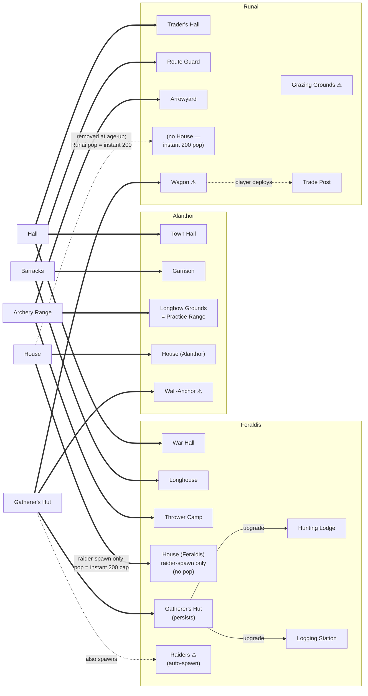
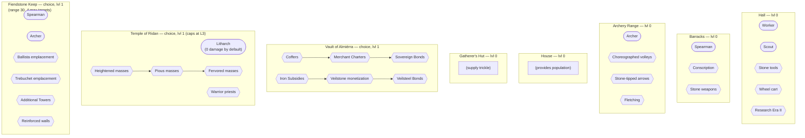

# The Waning Border — Complete Design Doc

> Single-file consolidation of **Age 0 + all three Age 1 cultures**.
> Merged from `Overview.md`, `Age_0.md`, `Age_1_Alanthor.md`,
> `Age_1_Runai.md`, `Age_1_Feraldis.md`, and `Tech_Tree.md`.
> Truth source: this file mirrors those docs verbatim; when in doubt,
> read this end-to-end for a single-pass view of the game's design.
>
> Doc version: 2026-05-19 — incorporates the Alanthor / Runai / Feraldis /
> Age 0 review passes.

---

## Table of Contents

- [Part I — Cross-cutting rules](#part-i--cross-cutting-rules)
  - [1.1 Age progression](#11-age-progression)
  - [1.2 North star: the Movement axis](#12-north-star-the-movement-axis)
  - [1.3 Population model](#13-population-model)
  - [1.4 Age-up: transform, don't replace](#14-age-up-transform-dont-replace)
  - [1.5 Unit granularity — singles vs battalions](#15-unit-granularity--singles-vs-battalions)
  - [1.6 Per-battalion military upgrades](#16-per-battalion-military-upgrades)
  - [1.7 Resource carry — Veilsteel Frenzy (Feraldis-only)](#17-resource-carry--veilsteel-frenzy-feraldis-only)
  - [1.8 Religious units — game-ender tier](#18-religious-units--game-ender-tier)
  - [1.9 Caravan kills feed Feraldis](#19-caravan-kills-feed-feraldis)
  - [1.10 Crystal-Curse neutrality (Runai-only)](#110-crystal-curse-neutrality-runai-only)
  - [1.11 The Glow economy](#111-the-glow-economy)
  - [1.12 The Petriarchy system](#112-the-petriarchy-system)
- [Part II — Age 0 (pre-culture)](#part-ii--age-0-pre-culture)
  - [2.1 Conventions](#21-conventions)
  - [2.2 Buildings](#22-buildings)
  - [2.3 Choice buildings (start L1)](#23-choice-buildings-start-l1)
  - [2.4 Units](#24-units)
  - [2.5 Age-up transitions](#25-age-up-transitions)
  - [2.6 Decisions](#26-decisions)
- [Part III — Age 1: Alanthor](#part-iii--age-1-alanthor)
  - [3.1 Culture identity](#31-culture-identity-alanthor)
  - [3.2 Cultured carryover buildings](#32-cultured-carryover-buildings-alanthor)
  - [3.3 Alanthor-unique buildings](#33-alanthor-unique-buildings)
  - [3.4 Alanthor units](#34-alanthor-units)
  - [3.5 Decisions](#35-decisions-alanthor)
- [Part IV — Age 1: Runai](#part-iv--age-1-runai)
  - [4.1 Culture identity](#41-culture-identity-runai)
  - [4.2 Age-up power spike — the wagon burst](#42-age-up-power-spike--the-wagon-burst)
  - [4.3 Cultured carryover buildings](#43-cultured-carryover-buildings-runai)
  - [4.4 Runai-unique buildings](#44-runai-unique-buildings)
  - [4.5 Trader-warriors](#45-trader-warriors-uncontrollable-lane-patrols)
  - [4.6 Runai units](#46-runai-units)
  - [4.7 Decisions](#47-decisions-runai)
- [Part V — Age 1: Feraldis](#part-v--age-1-feraldis)
  - [5.1 Culture identity](#51-culture-identity-feraldis)
  - [5.2 Cultured carryover buildings](#52-cultured-carryover-buildings-feraldis)
  - [5.3 House — raider-spawn building](#53-house-feraldis--raider-spawn-building)
  - [5.4 Persistent Gatherer's Hut + lodge upgrades](#54-persistent-gatherers-hut--lodge-upgrades)
  - [5.5 Feraldis-unique buildings](#55-feraldis-unique-buildings)
  - [5.6 Feraldis units](#56-feraldis-units)
  - [5.7 Decisions](#57-decisions-feraldis)
- [Appendix — Tech-tree charts](#appendix--tech-tree-charts)

---

# Part I — Cross-cutting rules

## 1.1 Age progression

The Waning Border is not like other traditional RTS games. Every player
starts on equal footing — there are only **two "ages"**.

- **Age 0** — All players have the same stats and the same options.
  Players must read the map and their enemies in order to plan for their
  next steps.
- **Age 1** — Players choose one of three cultures:

  | Culture | Focus |
  |---------|-------|
  | **Feraldis** | Military |
  | **Runai** | Economy |
  | **Alanthor** | Defense |

  From age-up onward, all progression is made through **building upgrades**
  (up to **level 3**). There is no Age 2 / Age 3 — the depth lives in the
  **culture × sect × upgrade** matrix, not in further ages.

---

## 1.2 North star: the Movement axis

Every faction's supply mechanic, military identity, and territorial
behavior is a different **relationship to movement on the map**. This is
the single clearest axis the game rotates around — when adding any new
unit, building, or tech, the first design question is *"how does this
interact with movement?"*.

| Faction | Relationship to movement | Economy is generated by… |
|---------|--------------------------|--------------------------|
| **Alanthor** | **Denies** movement | …enclosing space (closed wall compartments yield supplies) |
| **Feraldis** | **Preys on** movement | …inflicting damage (enemy / Crystal-Curse kills generate supplies) |
| **Runai** | **Embodies** movement | …moving (caravan-wagons in transit + lane-patrolling traders) |

Three corollary rules fall out of this axis:

1. **Every faction's supply mechanic needs a floor** — a thing the player
   can do alone, in their own territory, if the map isn't cooperating.
   Alanthor's floor is "build walls anywhere"; Feraldis's floor is
   **Crystal-Curse creatures / nodes count as damage targets** (so an
   isolated Feraldis player can always farm income from the curse);
   Runai's floor is their patrolling trader-warriors generating supplies
   along their own lanes regardless of who they meet.
2. **Asymmetric matchups are built into the triangle.** Feraldis preys
   on movement, Runai depends on movement, Alanthor denies movement. A
   Feraldis-vs-Runai match is a chase economy; a Feraldis-vs-Alanthor
   match is a siege economy; a Runai-vs-Alanthor match is a perimeter
   economy. These dynamics emerge for free — don't script them.
3. **Resist erosion of identity-defining absences.** Runai has **no
   walls** and **no Houses** (per the trade-lane design pass). Feraldis
   gets **instant 200 pop at age-up** (no Houses needed for pop), but
   *does* have Houses as a pure **raider-spawn / aggression tool** —
   each House build / upgrade spawns autonomous Raiders that attack the
   closest enemy. These absences and twists do real design work
   (lanes-as-defense for Runai, housing-as-pressure for Feraldis). Don't
   hand out "just a small palisade" to Runai or "Houses without raiders"
   to Feraldis later — each concession dilutes the triangle.

---

## 1.3 Population model

| Faction | Pop source | Pop cap behavior |
|---------|------------|------------------|
| **Alanthor** | House ladder (15 / 20 / 25 per House × 3 tiers) + Town Hall +20 | Gradual ramp via building investment. |
| **Runai** | **Instant 200 (game-cap) at age-up** — no House exists for Runai | Unlocks all at once on culture pick. |
| **Feraldis** | **Instant 200 (game-cap) at age-up** — no House required for pop | Unlocks all at once on culture pick. Houses still exist but only spawn Raiders; they do not contribute pop. |

---

## 1.4 Age-up: transform, don't replace

Age-up should feel like a **power spike, not a reset.** The pre-culture
**Gatherer's Hut** is the common root of all three economies — *raiding*
is "violent gathering," *walling* is "protected gathering," *trading* is
"networked gathering." Each faction's age-up transformation grows out of
the huts the player already invested in, so the player's Age 0 placement
decisions stay relevant.

| Faction | Hut transforms into… | Immediate Age-1 power-spike |
|---------|---------------------|-----------------------------|
| **Alanthor** | A wall-segment anchor that auto-fortifies a small radius around itself | Free pre-built wall ring around the player's base |
| **Feraldis** | A **raider unit** that auto-patrols outward seeking targets | Roaming raiders that start generating damage-income immediately |
| **Runai** | A **mobile caravan-wagon** the player deploys outward to plant the first trade post | Wagons output **full income while in transit** — age-up is Runai's peak income moment |

These transformations are the *only* free-territory bursts each faction
gets. Every trade post / wall / raid party built after age-up costs
builders + resources at the normal rate. Lose a transformation (e.g. a
Runai wagon killed in transit) and the player loses both:

- **Material cost** — equivalent to one Gatherer's Hut.
- **Tempo cost** — they must now establish that piece of map the slow way
  (send a builder, build a wall, recruit a unit manually).

> **Playtest heuristic** for tuning Feraldis vs Runai aggression: in a 1v1,
> the Runai player should land roughly **70–80 %** of their age-up wagons
> at destination with reasonable escort. Lower = Feraldis is too punishing
> on the transition; near 100 % = escorting doesn't matter.

---

## 1.5 Unit granularity — singles vs battalions

The Waning Border mixes two unit-control models. **Which model a unit
uses is determined by its category, not by faction:**

| Category | Granularity | Examples |
|----------|-------------|----------|
| **Economy** | **Single entity** per unit | Worker, Scout |
| **Player-trained military** | **Battalion** of N soldiers (predefined size — some sizes still TBD) controlled as one | Spearman, Swordsman, Royal Guard, Sentinel, Archer, Crossbowman, Berserker, Hunter, Skirmisher, Cataphract, Cavalry Archer, … |
| **Sect-unique units** | **Single entity** per unit | (TBD per the sect redesign) |
| **Building-spawned units** | **Single entity** per unit. **Usually uncontrolled** by the player (auto-patrol / auto-trade / auto-fight). | Runai Caravan, Runai Escort, Runai Trader-Warrior ⚠, Feraldis hut-raider ⚠ |

All numeric stat blocks below are written as **battalion-total values**
for battalion units (e.g. "Spearman HP 120" = battalion's pooled HP, not
per-soldier). This needs explicit verification once battalion sizes are
finalized.

---

## 1.6 Per-battalion military upgrades

Researching a weapon-tier, armor-tier, or arrow-tier tech at a military
building (Garrison, Practice Range, Longhouse, etc.) **does not auto-
upgrade your existing army.** Instead:

1. The research **unlocks** the next upgrade tier for units trained at
   that building.
2. After the tech is researched, each individual **battalion** in the
   field gains an "Upgrade" button.
3. Applying the upgrade **costs resources per battalion** and applies
   only to the targeted battalion — not faction-wide.
4. Newly-trained battalions still come out at the **base tier**; the
   player must upgrade each one manually.

This rule applies to **all three cultures' weapon / arrow / armor
ladders** — Alanthor's Stone → Iron → Veilstone → Glow-infused weapons,
the Stone-tipped → Iron-tipped → Veilstone-tipped → Glow-tipped arrows
of Practice Range / Arrowyard / Thrower Camp, the cavalry barding tiers
at Royal Stable / Grazing Grounds, and so on.

> **Why it matters for design:** this turns the tech tree into an
> *unlock* mechanic rather than a *power spike*, and shifts the resource
> sink onto per-battalion micro-management. Battalion identity persists
> across upgrades — a Stone-weapons Spearman battalion and an Iron-weapons
> Spearman battalion are *the same group of soldiers* with different
> gear, not different units.

---

## 1.7 Resource carry — Veilsteel Frenzy (Feraldis-only)

The earlier code mechanics defined two cross-faction "carry resource →
unit attack bonus" loops (Iron-carry: 5 slots, +2 % per ingot;
Veilsteel-carry: 5 slots, +3 % per ingot). These cross-faction loops are
**retired**. In the design:

- **Iron-carry is removed entirely.** No unit of any faction gets an
  attack bonus from carrying Iron.
- **Veilsteel-carry is Feraldis-only**, gated behind the **Veilsteel
  Frenzy** tech (the renamed `Feraldis_IronFury`), researched at the
  Feraldis War Hall. Feraldis units carry up to 5 Veilsteel shavings;
  each shaving grants +2 % attack (stacks to +10 %).

> **Why the rewrite:** a distinct, lore-rich combat-economy loop for
> Feraldis ("consume Veilsteel shavings as a psychoactive battle
> stimulant", evoking Norse berserkers and mushrooms) rather than a flat
> cross-faction bonus. Alanthor and Runai get their attack edge from
> walls / battalion upgrades / lane synergy instead.

---

## 1.8 Religious units — game-ender tier

The three culture-specific religious units (Alanthor's **Scholar**,
Runai's **Acolyte**, Feraldis's **Iconoclast**) are unified into a single
"game-ender" cost bracket. They are intentionally:

- **Tanky** (HP ≥ 90; Iconoclast is 280)
- **Slow** (speed ≤ 3.2)
- **Single units**, not battalions
- **Hard to replace** (long training time, high resource cost)
- **Strategically decisive** — each unblocks its faction's Crystal-Curse
  interaction (cleanse / convert / destroy), which in turn produces the
  game's only source of [Glow](#111-the-glow-economy)

| Unit | Train at | Cost (target bracket) |
|------|----------|----------------------|
| **Scholar** (Alanthor) | Temple of Ridan, **L3** | ~300 Supplies + 150 Iron + 100 Crystal + 30 Veilsteel |
| **Acolyte** (Runai) | Temple of Ridan, **L3** | ~300 Supplies + 150 Iron + 100 Crystal + 30 Veilsteel |
| **Iconoclast** (Feraldis) | Temple of Ridan, **L3** | ~300 Supplies + 150 Iron + 100 Crystal + 30 Veilsteel |

> **Training level:** Temple of Ridan caps at **L3**. Earlier drafts
> referenced "L4" — that was a retired spec-refinement stage, not a
> fourth upgrade level. All three religious units train at the
> fully-levelled (L3) Temple.

> **No Glow in the cost.** Iconoclast is the unit that *unblocks* Glow
> generation for Feraldis (by stripping `NodeUntargetable` from curse
> nodes). Requiring Glow to train any religious unit would be a
> chicken-and-egg. Losing one is meant to be a major setback — the
> player commits significant resources to gate open their faction's
> Glow path.

---

## 1.9 Caravan kills feed Feraldis

When a Runai **Caravan** is killed, the 50 % cargo drop is awarded
**only** to the killer if the killer is **Feraldis** (the cargo converts
to supplies for the Feraldis player). Alanthor and Runai killers gain
nothing — the cargo is destroyed.

| Killer | Cargo outcome |
|--------|---------------|
| Feraldis unit | **50 % of cargo → killer's supplies** |
| Alanthor unit | destroyed |
| Runai unit (friendly-fire / PvE) | destroyed |
| Crystal-Curse creature | destroyed |

This is a deliberate asymmetric synergy with Feraldis's damage-as-income
economy: their kill-economy mechanic already rewards killing non-military
units (via Pillage), and caravan kills feed the same loop with bigger
payouts. Runai players will need to escort caravans or re-route them
around known Feraldis patrol zones.

---

## 1.10 Crystal-Curse neutrality (Runai-only)

Runai gains **tech-gated neutrality** to the Crystal Curse over time.
Researched at the Trader's Hall. Example tech shape: **−20 % chance of
aggroing curse waves** when Runai units traverse cursed tiles. Curse
defences themselves stay in place — the curse resists *conversion*
(Runai's interaction type) harder than it resists *cleansing* (Alanthor)
or *destruction* (Feraldis).

Detail in [§ 4.3 Trader's Hall](#trader-s-hall--cultured-hall).

---

## 1.11 The Glow economy

**Glow** is a high-tier resource. It is **only created** by interacting
with **Crystal-Curse nodes**, and each node only ever yields Glow
**once** — the first time its state changes. Back-and-forth contesting
cannot fabricate infinite Glow.

| Source action | Available to | Notes |
|---------------|--------------|-------|
| **Cleanse** a curse node | Alanthor (via Scholar) | First cleansing of a node drops 1 Glow pickup on the ground. |
| **Convert** a curse node | Runai (via Acolyte) | First conversion of a node drops 1 Glow pickup on the ground. |
| **Destroy** a curse node | Feraldis (via Iconoclast-enabled army) | First destruction of a node drops 1 Glow pickup on the ground. |

### How Glow is dropped on the ground (and picked up)

Glow becomes a pickup on the map when:

1. A curse node's **first** state change (cleanse / convert / destroy)
   per the table above.
2. **Defeating a unit that is carrying Glow** or whose battalion has the
   Glow weapon / armor upgrade.
3. **Destroying a building that houses Glow** (e.g. a vault deposit or
   crafting facility with stored Glow).
4. The owning player **presses the "drop Glow" UI button** on a unit /
   building.

### Implications

- **Glow-infused weapons / Glow-tipped arrows / Glow-bonded armor** (the
  T4 tech across all cultures) are gated behind the curse-node economy.
  A faction that ignores the curse layer has no path to its T4 unit
  upgrades.
- The "once-per-node" rule means **Glow supply is finite per map**. This
  caps the late-game power ceiling and forces players to fight over the
  map's curse nodes if they want T4 units.
- Glow on the ground is a **vulnerability**: defeating a Glow-carrying
  unit drops it back into play. Glow-upgraded battalions are
  high-value targets.

> **(spec gap)** UI affordances for the "drop Glow" button, Glow stack
> limits per unit/building, and visual indicators that a battalion is
> currently carrying Glow upgrades.

---

## 1.12 The Petriarchy system

In the world of The Waning Border, **12 religious sects** control different
aspects of life and rulership.

After you choose your culture, invest in a temple. Out of the 12 sects,
**6 can be chosen**. Each adopted sect unlocks:

- One **map power**
- One **passive power**
- One **unit**
- One **building**
- One **technology**

Different sects have different synergies with your specific culture and
with each other, and you have a **limited amount of religion points** to
spend on adopting or upgrading sects. Choose wisely.

> The sect roster (Antiquity / Renewal / Fortitude / Reclamation / Silence
> / Justice / Veneration / Witness / War / Ash / Ruin / Wrath) and its
> mechanics are being redesigned under
> [task-sect-system-redesign-063](../../.deft/tasks/task-sect-system-redesign-063/task.md).
> Cost-per-pick: affinity 1 RP, non-affinity 2 RP.

---

# Part II — Age 0 (pre-culture)

> Authoritative spec for Age 0. Resources used in Age 0: **Supplies**,
> **Iron**, **Crystal**. Veilsteel and Glow do **not** appear in Age 0
> costs.

## 2.1 Conventions

- In Age 0 the player has **not yet picked a culture**, so the standard
  buildings (Hall, Barracks, Archery Range, House) exist only in their
  **lvl 0 / pre-culture form**. They have no in-Age-0 upgrade ladder —
  their lvl 1+ forms are the **cultured rename** that lands at age-up,
  detailed in Parts III–V.
- **Choice / unique buildings** (Vault of Almiérra, Shrine of Ridan,
  Fiendstone Keep) are different: built **complete at lvl 1** in Age 0
  and *can* be upgraded to lvl 2 / lvl 3 within Age 0 — these levels gate
  tier-tech research.
- **Population**: `popCost` = consumed by units, `provides.population` =
  housing.
- **Training time** is in seconds at the trainer's lvl 0 (pre-culture
  form). Trainer levels reduce train time only in Age 1+.
- **Damage formula:**
  `finalDamage = baseDamage × dmgTypeVsArmor × (1 − defense / (defense + 100))`.

---

## 2.2 Buildings

### Hall — lvl 0 (pre-culture)

Starting building. Provides economic units and core economy research.
Acts as a resource drop-off. At age-up the Hall **renames and reskins** to
its cultured form (`Town Hall` / `Trader's Hall` / `War Hall`).

| Stat | Value |
|------|-------|
| HP | 2 400 |
| Line of Sight | 24 |
| Auto-fire max targets | 1 |
| Provides population | 20 |
| Build cost | starting (free) |

#### Trainable units

| Unit | Train time | Cost | Pop | Notes |
|------|-----------|------|-----|-------|
| **Worker** | 5 s | 50 Supplies | 1 | Unified Builder + Miner. |
| **Scout** | 4 s | 55 Supplies | 1 | Moved from Barracks to Hall. |

#### Researchable techs

| Tech | Cost | Time | Effect | Code id |
|------|------|------|--------|---------|
| **Stone tools** | 80 S + 40 I | 30 s | +15 % gathering speed | `ImprovedTools` (rename pending) |
| **Wheel cart** | 90 S | 25 s | +5 resource carry capacity | `StorageCarts` (currently +10 in code → reduce to +5) |
| **Advance to Era II** | 1 000 S + 200 I + 150 C | — | Triggers age-up, opens culture choice. Requires 1 of `Shrine of Ridan` / `Vault of Almiérra` / `Fiendstone Keep` built. | `Research_Era2` |

---

### Barracks — lvl 0 (pre-culture)

Trains melee units. At age-up renames to `Garrison` / `Route Guard` /
`Longhouse`.

| Stat | Value |
|------|-------|
| HP | 800 |
| Line of Sight | 18 |
| Train-time multiplier | ×1.00 |
| Build cost | 220 Supplies + 40 Iron |

#### Trainable units

| Unit | Train time | Cost | Pop |
|------|-----------|------|-----|
| **Spearman** | 7 s | 80 S + 30 I | 1 |

#### Researchable techs

| Tech | Cost | Time | Effect | Code id |
|------|------|------|--------|---------|
| **Conscription** | 100 S + 40 I | 35 s | +20 % training speed at the Barracks | **(new — replaces `BasicDrills`)** |
| **Stone weapons** | 80 S | 25 s | Unlocks unit upgrade 1 (Spearman tier-1 stat bump — see [§ 1.6](#16-per-battalion-military-upgrades)) | **(new — replaces `WoodenArmor`)** |

---

### Archery Range — lvl 0 (pre-culture)

Trains ranged units. At age-up renames to `Longbow Grounds` / `Arrowyard` /
`Thrower Camp`.

| Stat | Value |
|------|-------|
| HP | 600 |
| Line of Sight | 18 |
| Train-time multiplier | ×1.00 |
| Build cost | 180 Supplies + 50 Iron |

#### Trainable units

| Unit | Train time | Cost | Pop |
|------|-----------|------|-----|
| **Archer** | 15 s | 50 S + 25 I | 1 |

#### Researchable techs

| Tech | Cost | Time | Effect |
|------|------|------|--------|
| **Choreographed volleys** | 120 S + 30 I | 35 s | Active skill: 2× fire rate of all Archers for 5 s. 40 s cooldown. **(new)** |
| **Stone-tipped arrows** | 80 S + 20 I | 25 s | Unlocks tier-1 arrow upgrade (per-battalion). **(new)** |
| **Fletching** | 80 S + 30 I | 30 s | +15 % range for Archers (attackRange 25 → 28.75). **(new)** |

---

### Gatherer's Hut — Age 0 only

Early supply generation, exclusive to Age 0. Transforms (or persists, for
Feraldis) at age-up — see [§ 2.5](#25-age-up-transitions).

| Stat | Value |
|------|-------|
| HP | 800 |
| Line of Sight | 16 |
| Aura | +60 Supplies / minute, radius 12 |
| Build cost | 120 Supplies + 10 Iron |
| Provides population | 0 |

No level-up path. No trainable units. No tech.

---

### House (a.k.a. Hut) — lvl 0 (pre-culture)

Provides population in Age 0. At age-up the per-culture behavior splits
three ways:

- **Alanthor** — renamed / reskinned to House (Alanthor); standard pop
  ladder applies.
- **Runai** — no House exists post-age-up. Runai pop is set to **200
  (game cap) instantly** at age-up; standing Age 0 Houses are removed.
- **Feraldis** — Houses remain but **pop becomes 0** (Feraldis also gets
  instant 200 pop). Houses convert into pure **raider-spawn buildings**
  ([§ 5.3](#53-house-feraldis--raider-spawn-building)).

| Stat | Value |
|------|-------|
| HP | 600 |
| Line of Sight | 14 |
| Provides population | 10 |
| Build cost | 80 Supplies |

Display name is **House**; internal code id is `Hut`.

---

## 2.3 Choice buildings (start L1)

Three mutually-exclusive **choice buildings** in Age 0 — the player picks
one to unlock age-up research. All three start at lvl 1 (no lvl 0 form).

### Vault of Almiérra

Resource bank. Resources can be deposited for an extended duration and
generate interest.

| Stat | L1 (base) | L2 | L3 |
|------|-----------|----|----|
| HP | 1 200 | 1 380 | 1 440 |
| Line of Sight | 14 | 14 | 14 |
| Interest rate (compounded, per minute) | **25 %** | 50 / 75 / 100 % (banking-tier tech) | — |
| Culture modifier | **Alanthor +30 % yield**, **Runai −30 %**, Feraldis neutral | | |
| Build / upgrade cost | 300 S + 100 C (build) | 200 S + 50 I + 15 C | 400 S + 100 I + 40 C |
| Upgrade duration | — | 30 s | 45 s |

#### Researchable techs

The three banking-grade techs are **mutually exclusive tiers** — the
player can only have one banking grade active at a time.

| Tech | Building lvl req. | Cost | Time | Effect |
|------|------------------|------|------|--------|
| **Coffers** | L1 | 150 S + 40 I | 30 s | Bumps interest tier to 50 % / min. *(Safe storage — "the Vault keeps coin"  )* |
| **Merchant Charters** | L1 | 200 S + 80 I | 35 s | Bumps interest tier to 75 % / min. *(Active credit — "the Vault lends to traders"  )* |
| **Sovereign Bonds** | L1 | 250 S + 120 I | 40 s | Bumps interest tier to 100 % / min. *(High-stakes investment — "the Vault speculates"  )* |
| **Iron Subsidies** | L1 | 180 S + 80 I | 35 s | Unlocks **Iron** banking. |
| **Veilstone monetization** | L2 | 220 S + 100 I + 40 C | 40 s | Unlocks **Veilstone** (Crystal) banking. |
| **Veilsteel Bonds** | L3 | 300 S + 120 I + 60 C | 50 s | Unlocks **Veilsteel** banking. |

> Compound interest model (confirmed): `next = current × (1 + rate / 100)`
> per minute. Worked example: at 60 % rate, depositing 100 yields 160
> after 1 min and 256 after 2 min.

---

### Shrine of Ridan

Early religious / Litharch training. Slowly heals all friendly units
within a 10-unit radius (1 s ticks). On build, awards **+1 Religion
Point**; +1 additional RP if the player chooses **Runai** at age-up.

| Stat | L1 (base) | L2 | L3 |
|------|-----------|----|----|
| HP | 800 | 920 | 960 |
| Line of Sight | 16 | 16 | 16 |
| Heal rate (% Max HP / s, in radius 10) | 1 % | 3 % (Heightened) → 6 % (Pious) | 15 % (Fervored) |
| Culture modifier | **Runai +30 %** heal, **Feraldis −30 %**, Alanthor neutral | | |
| Build / upgrade cost | 300 S + 100 C (build) | 200 S + 50 I + 15 C | 400 S + 100 I + 40 C |
| Upgrade duration | — | 30 s | 45 s |

#### Trainable units

| Unit | Train time | Cost | Pop |
|------|-----------|------|-----|
| **Litharch** | 7 s | 100 S + 25 I + 10 C | 1 |

(Plus the **religious culture unit** — Scholar / Acolyte / Iconoclast —
at L3. See [§ 1.8](#18-religious-units--game-ender-tier).)

#### Researchable techs

| Tech | Building lvl req. | Cost | Time | Effect |
|------|------------------|------|------|--------|
| **Heightened masses** | L1 | 150 S + 40 C | 30 s | Heal rate 1 % → 3 % / s. |
| **Warrior priests** | L1 | 180 S + 50 I + 20 C | 35 s | Litharchs gain a melee attack (default damage TBD — Litharch has 0 base damage until this tech). |
| **Pious masses** | L2 | 220 S + 80 C | 40 s | Heal rate 3 % → 6 % / s. Requires Heightened masses. |
| **Fervored masses** | L3 | 320 S + 120 C | 50 s | Heal rate 6 % → 15 % / s. Requires Pious masses. |

---

### Fiendstone Keep

Fortified position. Generates a modest amount of Supplies (half what the
Hall produces). Trains all non-religious, non-siege military units.
Faster training time than other buildings. Large HP pool, fires arrow
volleys at enemies.

| Stat | L1 (base) | L2 | L3 |
|------|-----------|----|----|
| HP | 2 000 | 2 300 | 2 400 |
| HP with **Feraldis** (+50 %) | 3 000 | 3 450 | 3 600 |
| HP with **Alanthor** (−50 %) | 1 000 | 1 150 | 1 200 |
| Line of Sight | 18 | 18 | 18 |
| Auto-fire max targets | **4** | 4 (+2 with Additional Towers) | 4 (+2) |
| Auto-fire damage / cooldown | **20 dmg / 2.0 s (range 30)** | with **Ballista emplacement**: +18 siege dmg shot | with **Trebuchet emplacement**: +36 siege dmg AoE shot |
| Provides population | 20 | 20 | 20 |
| Train-time multiplier | ×1.00 (already 25 % faster aura per code) | ×0.870 | ×0.800 |
| Build / upgrade cost | 300 S + 100 C (build) | 200 S + 50 I + 15 C | 400 S + 100 I + 40 C |
| Upgrade duration | — | 30 s | 45 s |

#### Trainable units

In Age 0 inherits the rosters of Barracks + Archery Range (no level
prerequisites — the Keep itself is the gating building):

| Unit | Train time | Cost | Pop |
|------|-----------|------|-----|
| **Spearman** | 7 s | 80 S + 30 I | 1 |
| **Archer** | 15 s | 50 S + 25 I | 1 |

Once a culture is chosen at age-up, also trains that culture's basic
cavalry unit (Runai Raider / Feraldis Warboar Rider / Alanthor
Cataphract).

#### Researchable techs

| Tech | Building lvl req. | Cost | Time | Effect |
|------|------------------|------|------|--------|
| **Ballista emplacement** | L1 | 200 S + 80 I | 35 s | Keep auto-fire gains a per-cooldown ballista shot (siege, single-target). |
| **Trebuchet emplacement** | L2 | 300 S + 140 I + 50 C | 45 s | Keep auto-fire gains a trebuchet shot (siege, AoE). |
| **Additional Towers** | L2 | 240 S + 80 I | 35 s | Max auto-fire targets +2. |
| **Reinforced walls** | L1 | 180 S + 60 I | 30 s | Keep HP +20 % (applied after culture modifier — stacks; e.g. Feraldis: 2 000 × 1.50 × 1.20 = 3 600). |

---

## 2.4 Units

### Worker — unified Builder + Miner

| Field | Value |
|------|-------|
| Class | `human_support` |  TO DO: change to "Economy"
| HP | 70 |
| Speed | 6.0 |
| Training time | 5 s |
| Armor type | infantry_light |
| Damage | 2 (melee, self-defense only) |
| Defense (M/R/S/Mg) | 0 / 0 / 0 / 0 |
| Attack range | 1.0 |
| Line of Sight | 14 |
| **Build speed** | 1.0 |
| **Gathering speed** | 1.0 |
| **Carry capacity** | 1 (+5 with Wheel cart → 6) |
| Cost | 50 Supplies |
| Pop cost | 1 |
| Single / battalion | Single ([§ 1.5](#15-unit-granularity--singles-vs-battalions)) |

### Scout

| Field | Value |
|------|-------|
| Class | `human_support` |
| HP | 60 |
| Speed | 6.0 |
| Training time | 4 s |
| Armor type | infantry_light |
| Damage | 2 (melee) |
| Defense | 0 / 0 / 0 / 0 |
| Attack range | 1.0 |
| Line of Sight | **40** (extreme vision is the role) |
| Cost | 55 Supplies |
| Pop cost | 1 |
| Single / battalion | Single |

### Spearman

| Field | Value |
|------|-------|
| Class | `human_melee` |
| HP | 120 |
| Speed | 5.5 |
| Training time | 7 s |
| Armor type | infantry_heavy |
| Damage | 10 (melee) |
| Attack speed | 1.5 s cooldown |
| Defense (M/R/S/Mg) | 1 / 0 / 0 / 0 |
| Attack range | 1.5 |
| Line of Sight | 16 |
| Cost | 80 Supplies + 30 Iron |
| Pop cost | 1 |
| Single / battalion | Battalion |
| Notes | Bonus vs cavalry via `melee` × `cavalry` modifier (0.9). |

### Archer

| Field | Value |
|------|-------|
| Class | `human_ranged` |
| HP | 90 |
| Speed | 5.2 |
| Training time | 15 s |
| Armor type | ranged |
| Damage | 17 (ranged) |
| Attack speed | 2.0 s cooldown |
| Defense | 0 / 1 / 0 / 0 |
| Attack range | 25 (28.75 with Fletching) |
| Min attack range | 1 |
| Line of Sight | 20 |
| Cost | 50 Supplies + 25 Iron |
| Pop cost | 1 |
| Single / battalion | Battalion |
| Active skill (post Choreographed volleys) | Halve cooldown to 1.0 s for 5 s, then 40 s cooldown. Faction-wide skill triggered at the Archery Range UI. |

### Litharch

| Field | Value |
|------|-------|
| Class | `human_support` |
| HP | 120 |
| Speed | 5.5 |
| Training time | 7 s |
| Armor type | ranged |
| Damage | **0 (Litharchs cannot attack — they are pure healers).** Warrior priests tech grants attack ability. |
| Heal | 6 HP / s on target (single-target right-click heal). Shrine's *aura* heal is separate. |
| Defense (M/R/S/Mg) | 0 / 0 / 0 / 2 |
| Attack range | 10 (heal range) |
| Line of Sight | 20 |
| Cost | 100 Supplies + 25 Iron + 10 Crystal |
| Pop cost | 1 |
| Single / battalion | Single |
| Trains at | Shrine of Ridan |

---

## 2.5 Age-up transitions

At age-up the player chooses a culture (Runai / Feraldis / Alanthor) and
the pre-culture buildings standing on the map are renamed, reskinned, and
become the lvl 1 form of their cultured variant.

| Age 0 building | Alanthor (lvl 1) | Runai (lvl 1) | Feraldis (lvl 1) |
|----------------|------------------|---------------|------------------|
| Hall | Town Hall | Trader's Hall | War Hall |
| Barracks | Garrison | Route Guard | Longhouse |
| Archery Range | Longbow Grounds | Arrowyard | Thrower Camp |
| House | House (Alanthor) — standard pop ladder | *(no House — Runai gets instant 200 pop)* | **House (Feraldis)** — raider-spawn building only (0 pop) |
| **Gatherer's Hut** | **transforms into a wall-segment anchor** | **transforms into a mobile caravan-wagon** | **persists** — upgradeable to Hunting Lodge / Logging Station; **also spawns Raider units at age-up** |

> **Transform, don't replace.** This is the cross-faction rule for the
> Gatherer's Hut at age-up — see [§ 1.4](#14-age-up-transform-dont-replace).
> Each transformation is the **only** free-territory burst the faction
> ever gets.

The three **choice buildings** keep their names across cultures (no
rename): Vault of Almiérra, Shrine of Ridan, Fiendstone Keep. Only
**culture modifier** changes (Vault ±30 %, Shrine ±30 %, Keep ±50 %).

---

## 2.6 Decisions

| # | Question | Resolution |
|---|----------|-----------|
| 1 | Stone weapons / Stone-tipped arrows "unit upgrade 1" stat line | **Resolved.** Unlock model — see [§ 1.6](#16-per-battalion-military-upgrades). Per-tier numbers TBD. |
| 2 | Warrior priests Litharch melee damage | **Resolved.** Litharch has **0 damage by default**; Warrior priests grants attack ability. Damage value TBD. |
| 3 | Fiendstone Keep base ranged stats | **Resolved.** **Range 30** (from 25), **max targets 4** (from 3). 20 dmg / 2.0 s cooldown unchanged. |
| 4 | Vault interest model | **Resolved.** Compound — `next = current × (1 + rate / 100)` per minute. Worked example: 100 → 160 → 256 at 60 % / min. |
| 5 | Banking tier names | **Resolved.** Coffers / Merchant Charters / Sovereign Bonds. |
| 6 | Feraldis housing in early game | **Resolved.** Feraldis pop is **200 (game cap) instantly at age-up** — no building required. Houses still exist but only spawn raiders, no pop. **Cross-faction:** Runai also instant 200 (no House at all). |
| 7 | Gatherer's Hut at age-up | **Resolved.** Huts **transform** per culture (wall-anchor / wagon / Hunting Lodge or Logging Station). No despawn. |

### Remaining open

- Per-tier stat numbers for unit upgrade ladders.
- Warrior priests Litharch damage / cooldown.
- Fiendstone Keep range/target playtest validation.

---

# Part III — Age 1: Alanthor

## 3.1 Culture identity (Alanthor)

| Aspect | Alanthor |
|--------|----------|
| Focus | **Defense** (walls, towers, long-range archery, building HP) |
| Style | Stone / Medieval |
| Economy | **Walled compartments only** — supplies generate inside closed wall areas; when a wall segment falls, that compartment's income pauses until repaired. |
| Vault yield modifier | **+30 %** (best of the three cultures) |
| Shrine heal modifier | neutral (0 %) |
| Fiendstone Keep HP/arrows | **−50 %** (worst of the three) |
| Main upgrade hooks | `KingsCourt` global aura: **+10 % building HP**, **+15 % repair rate** |

### Conventions — Age 1 (applies to all three cultures)

- **Building levels** are **L1 / L2 / L3** (lvl 0 was the pre-culture
  Age 0 form, which no longer exists once the building reskins).
- HP / train-time / attack-cooldown multipliers are **absolute over
  base, not cumulative** (so L2 HP = base × 1.15, not L1 × 1.15).
- Upgrade durations: L1 → L2 = 30 s, L2 → L3 = 45 s. L0 → L1 happens
  at age-up automatically.
- "Base HP" is the **uncultured Age 0 HP** carried forward (Hall = 2 400,
  Barracks = 800, Archery Range = 600, Hut = 600). Cultured renames keep
  the same base — only the multiplier ladder applies.

---

## 3.2 Cultured carryover buildings (Alanthor)

### Town Hall — cultured Hall

**Code id:** `KingsCourt` (rename to `TownHall` queued).

| Stat | L1 | L2 | L3 |
|------|----|----|----|
| HP (vs base 2 400) | 2 640 | 2 760 | 2 880 |
| Line of Sight | 26 | 26 | 26 |
| Auto-fire max targets | 1 | 2 | 4 |
| Provides population | 10 (code value — design draft silent) | 10 | 10 |
| Train-time multiplier | ×0.870 | ×0.800 | ×0.714 |
| Build / upgrade cost | (at age-up — already standing) | 200 S + 50 I + 15 C | 400 S + 100 I + 40 C + 5 Vs |
| Upgrade duration | — | 30 s | 45 s |

**Global aura:** +10 % HP and +15 % repair rate to all friendly
buildings within faction.

#### Trainable units

| Unit | Train time | Cost | Pop |
|------|-----------|------|-----|
| **Worker** | 5 s | 50 Supplies | 1 |
| **Scout** | 4 s | 55 Supplies | 1 |

#### Researchable techs

| Tech (tier) | Building lvl req. | Effect (unlock) |
|-------------|-------------------|------------------|
| **Stone tools** (T1) → **Iron tools** (T2) → **Veilstone tools** (T3) → **Veilsteel tools** (T4) | L1 / L2 / L3 / L3 | Unlocks per-Worker upgrade tier ([§ 1.6](#16-per-battalion-military-upgrades)) |
| **Wheel cart** | L1 | +20 % worker move speed *(faction-wide passive)* |
| **Cranes** | L2 | +10 carry capacity for workers *(faction-wide passive)* |
| **Mason Guild** | L2 | +20 % HP to all friendly buildings *(faction-wide passive)* — canonical name; replaces old draft "Masonry" / code `Alanthor_MasonGuild` |
| **`Alanthor_StoneLedgers`** *(code-existing)* | L1 | +8 Supplies per 10u² closed compartment / min *(placeholder yield, needs playtest)* |

---

### Garrison — cultured Barracks

**Code id:** `Barracks` (visual reskin only).

| Stat | L1 | L2 | L3 |
|------|----|----|----|
| HP (vs base 800) | 880 | 920 | 960 |
| Line of Sight | 18 | 18 | 18 |
| Train-time multiplier | ×0.870 | ×0.800 | ×0.714 |
| Upgrade cost | 80 S + 20 I | 160 S + 40 I + 10 C | 320 S + 80 I + 30 C |
| Upgrade duration | 20 s | 30 s | 45 s |

#### Trainable units

The Garrison trains a **3-tier infantry ladder** (Spearman → Swordsman →
Royal Guard) **plus** the **Sentinel** as a parallel late-game
damage-sponge unit. **Cataphract has been moved out** of Garrison into a
new [Royal Stable](#royal-stable--new) building.

| Doc name | Role / window | Lvl unlock | Code id | Stats |
|----------|--------------|-----------|---------|-------|
| **Spearman** | early-mid game line infantry | L1 | `Spearman` | HP 120 / 7 s train / 80 S + 30 I / pop 1 |
| **Swordsman** | mid-late game line infantry | L2 | **(new)** | TBD |
| **Royal Guard** | late-game line infantry (Spearman apex) | L3 | **(new)** | TBD |
| **Sentinel** | late-game **damage-sponge / siege-melee** *(parallel, not on the line-infantry tier)* | L2 | `Alanthor_Sentinel` | HP 160 / spd 5.0 / 18 s train / dmg 12 melee / def 3/2/0/1 / range 1.7 / cost 90 S + 20 Vs / pop 1 |

> All four are battalion units ([§ 1.5](#15-unit-granularity--singles-vs-battalions)).

#### Researchable techs

| Tech | Lvl req. | Effect (unlock) |
|------|----------|------------------|
| **Conscription** | L1 | +20 % training speed at the Garrison *(faction-wide passive)* |
| **Academy** | L2 | TBD — design draft only |
| **Stone weapons** (T1) → **Iron weapons** (T2) → **Veilstone weapons** (T3) → **Glow-infused weapons** (T4) | L1 / L2 / L3 / L3 + Glow | Unlocks per-battalion weapon upgrade tier |

---

### Practice Range — cultured Archery Range

**Code id:** `Alanthor_PracticeRange`.

| Stat | L1 | L2 | L3 |
|------|----|----|----|
| HP (vs base 600) | 660 | 690 | 720 |
| Line of Sight | 22 | 22 | 22 |
| Train-time multiplier | ×0.870 | ×0.800 | ×0.714 |
| Provides population | 0 | 0 | 0 |
| Garrison slots / arrow-fire | 6 / yes | 6 | 6 |
| Upgrade cost | (at age-up — already standing) | 160 S + 40 I + 10 C | 320 S + 80 I + 30 C |

> TechTree.json over-tunes (1 500 HP, +8 pop) are **rejected per Q#3** —
> follow the standard cultured-building multiplier path.

#### Trainable units

3-tier ranged ladder parallel to Garrison's infantry ladder.

| Doc name | Lvl unlock | Code id | Stats |
|----------|-----------|---------|-------|
| **Archer** | L1 | `Archer` | HP 90 / 15 s train / 50 S + 25 I / range 25 / pop 1 |
| **Crossbowman** | L2 | `Alanthor_Crossbowman` | HP 100 / spd 5.0 / 22 s train / dmg 13 ranged / def 0/2/0/0 / range 13 / min 4 / cost 70 S + 15 Vs / pop 1 |
| **L3 apex ranged** *(name TBD — "Longbowman"?)* | L3 | **(new)** | TBD |

#### Researchable techs

| Tech | Lvl req. | Effect (unlock) |
|------|----------|------------------|
| **Choreographed volleys** | L1 | Active skill: 2× fire rate for 5 s on all Archers in faction, 40 s cd |
| **Fletching** | L2 | +15 % attack range for all Archer-class units *(faction-wide passive)* |
| **Stone-tipped arrows** (T1) → **Iron-tipped** (T2) → **Veilstone-tipped** (T3) → **Glow-tipped** (T4) | L1 / L2 / L3 / L3 + Glow | Unlocks per-battalion arrow upgrade tier |

---

### House — cultured Hut

Visual reskin only.

| Stat | L1 | L2 | L3 |
|------|----|----|----|
| HP (vs base 600) | 660 | 690 | 720 |
| Line of Sight | 14 | 14 | 14 |
| Provides population | 15 (+HutBonusPop[1]) | 20 | 25 |
| Upgrade cost | 60 S + 10 I | 120 S + 25 I + 5 C | 240 S + 50 I + 15 C |
| Upgrade duration | 20 s | 30 s | 45 s |

No trainable units or tech.

---

### Gatherer's Hut → wall-segment anchor

At age-up for **Alanthor**, each Gatherer's Hut **transforms in place
into a wall-segment anchor** that auto-fortifies a small radius around
itself. This produces Alanthor's age-up power spike: a **free pre-built
ring of walls** around the player's existing footprint.

The anchor is the seed of the wall-economy mechanic — supplies generate
from **closed compartments**. The player must connect anchors with
`Alanthor_Wall` segments to start earning.

> **(spec gap)** Concrete numbers: radius, HP of auto-segments, whether
> segments can be deleted / rebuilt freely.

---

## 3.3 Alanthor-unique buildings

> Cost source: all build costs in this section come from
> [BuildCosts.cs](../../Assets/Scripts/Data/TechTree/BuildingCosts.cs)
> (runtime authoritative).

### Royal Stable — *new* (Cataphract host)

> Added per Q#2 review to move Cataphract out of the Garrison roster.

| Stat | L1 | L2 | L3 |
|------|----|----|----|
| HP | TBD (suggest ≈1 000 base) | base × 1.10 | base × 1.20 |
| LoS | TBD (suggest 18) | 18 | 18 |
| Train-time multiplier | ×0.870 | ×0.800 | ×0.714 |
| Build cost (L1) | TBD (suggest 220 S + 80 I) | 160 S + 40 I + 10 C | 320 S + 80 I + 30 C |

#### Trainable units

| Doc name | Lvl unlock | Code id | Stats |
|----------|-----------|---------|-------|
| **Cataphract** | L1 | `Alanthor_Cataphract` | HP 180 / spd 6.6 / 25 s train / dmg 20 melee / def 2/1/0/0 / range 1.6 / cost 220 S + 80 I + 40 C / pop 1 |
| *(L2 / L3 cavalry tiers)* | TBD | **(new)** | TBD |

#### Researchable techs

Same 4-tier per-battalion upgrade pattern (Barding T1 → T2 → T3 → T4 —
names TBD).

### Alanthor Wall

| HP | LoS | Defense (M/R/S/Mg) | Build cost | Role |
|----|-----|---|------------|------|
| 900 | 10 | 2 / 2 / 0 / 0 | 50 S + 20 I | Compartment boundary. Anchors the Alanthor economy. |

### Wall Tower

| HP | LoS | Defense | Build cost | Role |
|----|-----|---|------------|------|
| 500 | 16 | 2 / 3 / 0 / 0 | 60 S + 30 I | Wall instance upgraded to ranged tower. |

### Wall Gate

| HP | LoS | Defense | Build cost | Role |
|----|-----|---|------------|------|
| 200 | 8 | 1 / 1 / 0 / 0 | 40 S + 15 I | Wall instance upgraded to gate — auto-opens for friendlies. |

### Watch Tower

| HP | LoS | Defense | Garrison / arrow-fire | Build cost | Role |
|----|-----|---|-----|------------|------|
| 950 | **28** | 2 / 3 / 0 / 0 | 4 / yes | 140 S + 70 I | Stand-alone defensive tower (not anchored to a wall). |

### Siege Yard

| HP | LoS | Defense | Build cost | Trains |
|----|-----|---|------------|--------|
| 1 300 | 20 | 1 / 1 / 0 / 0 | 260 S + 100 I + 60 C | Alanthor_Ballista |

### Smelter

| HP | LoS | Defense | Build cost | Role |
|----|-----|---|------------|------|
| 1 200 | 18 | 1 / 1 / 0 / 0 | 220 S + 100 I | Iron processing (and later Veilsteel input). |

### Crucible

| HP | LoS | Defense | Loss factor | Build cost | Role |
|----|-----|---|------|------------|------|
| 1 200 | 18 | 1 / 1 / 0 / 0 | 20 % | 300 S + 80 Crystal + 30 Veilsteel ⚠ | Veilsteel forging (Iron + Crystal → Veilsteel). |

> ⚠ The 30-Veilsteel build cost is a **chicken-and-egg** in BuildCosts.cs
> — you need a Crucible to forge Veilsteel, but you need Veilsteel to
> build it. TechTree.json's 200 S + 60 I + 40 C is more sensible. Flag.

---

## 3.4 Alanthor units

### Alanthor Sentinel — heavy infantry

| Field | Value |
|------|-------|
| Class | `human_melee` |
| HP | 160 / Speed 5.0 / Train 18 s / Min bldg lvl 2 |
| Armor | infantry_heavy |
| Damage | 12 (melee) |
| Defense (M/R/S/Mg) | 3 / 2 / 0 / 1 |
| Attack range | 1.7 / LoS 18 |
| Cost | 90 Supplies + 20 Veilsteel / Pop 1 |
| Trains at | Garrison |

### Alanthor Crossbowman — heavy ranged

| Field | Value |
|------|-------|
| Class | `human_ranged` |
| HP | 100 / Speed 5.0 / Train 22 s / Min bldg lvl 2 |
| Armor | ranged |
| Damage | 13 (ranged) |
| Defense | 0 / 2 / 0 / 0 |
| Attack range | 13 / min 4 / LoS 22 |
| Cost | 70 Supplies + 15 Veilsteel / Pop 1 |
| Trains at | Practice Range L2 |

### Alanthor Cataphract — heavy cavalry

| Field | Value |
|------|-------|
| Class | `human_cavalry` |
| HP | 180 / Speed 6.6 / Train 25 s |
| Armor | cavalry |
| Damage | 20 (melee) |
| Defense | 2 / 1 / 0 / 0 |
| Attack range | 1.6 / LoS 20 |
| Cost | 220 Supplies + 80 Iron + 40 Crystal / Pop 1 |
| Trains at | Royal Stable |

### Alanthor Ballista — siege

| Field | Value |
|------|-------|
| Class | `machinery_siege` |
| HP | 220 / Speed 3.2 |
| Armor | ranged |
| Damage | 40 (siege) |
| Defense | 0 / 1 / 2 / 0 |
| Attack range | 22 / min 6 / LoS 26 |
| Cost | 180 Supplies + 80 Iron + 40 Crystal / Pop 1 |
| Trains at | Siege Yard |

### Alanthor Scholar — religious / magic (game-ender)

| Field | Value |
|------|-------|
| Class | `human_magic` |
| HP | 90 / Speed 3.0 / Train 30 s / Min bldg lvl **3** *(Temple of Ridan L3)* |
| Armor | ranged |
| Damage | 0 / type magic |
| Defense | 0 / 0 / 0 / 1 |
| LoS | 14 |
| Cost | **~300 Supplies + 150 Iron + 100 Crystal + 30 Veilsteel** (cross-faction game-ender tier — [§ 1.8](#18-religious-units--game-ender-tier)) |
| Pop | 1 |
| Single / battalion | Single |
| Role | Channels **Purification** rituals on Active crystal nodes — Alanthor's Glow-generator. Vulnerable, needs escort. |

---

## 3.5 Decisions (Alanthor)

| # | Resolution |
|---|-----------|
| 1 | **`KingsCourt` → `TownHall` rename** — confirmed. |
| 2 | **Garrison roster** — 3-tier Spearman → Swordsman → Royal Guard ladder + Sentinel (parallel damage-sponge). **Cataphract moves to new Royal Stable.** |
| 3 | **Practice Range HP/pop** — drop over-tune; use multiplier path 660/690/720 HP, 0 pop. |
| 4 | **4-tier tech ladder** — per-battalion unlock model ([§ 1.6](#16-per-battalion-military-upgrades)). |
| 5 | **Glow source / drop rules** — see [§ 1.11](#111-the-glow-economy). |
| 6 | **`Masonry` vs `Alanthor_MasonGuild`** — canonical name is **Mason Guild**. |
| 7 | **Practice Range ranged ladder** — same 4-tier per-battalion pattern as Garrison. |
| 8 | **Wall economy yield** — `+8 supplies per 10u² compartment / min` is a placeholder pending playtest. |
| 9 | **Build-cost discrepancies** — BuildCosts.cs is authoritative. Exception: Crucible's 30-Veilsteel chicken-and-egg, flagged for fix. |

### Remaining open

- Battalion sizes for all Garrison / Practice Range / Royal Stable units.
- Royal Stable numeric stats (HP base, build cost, defense, LoS).
- L2 / L3 Cataphract tier names + stats.
- L3 ranged apex name (placeholder "Longbowman").
- Crucible build-cost fix.
- `Academy` tech effect.

---

# Part IV — Age 1: Runai

## 4.1 Culture identity (Runai)

> Runai **embodies movement** — economy, army, and territory all fused
> into the **trade lane**. Build a lane → it earns supplies → it
> auto-spawns patrolling trader-warriors → it claims that corridor of the
> map. One decision, three rewards. **No walls, no Houses** — lanes are
> their defense; caravan-driven mechanics are their pop curve.

| Aspect | Runai |
|--------|-------|
| Focus | Economy / movement — lanes are economy + army + territory fused |
| Style | Tents / Desert / nomadic traders |
| Economy | **Mixed: Iron is mined, Supplies + Crystal come from trade routes.** Workers mine iron normally. Supplies and Crystal earned exclusively through **trade lanes** — plant a Trade Post → a lane forms between it and any other Trade Post or the Trader's Hall → caravans travel the lane and earn (yield scales with route length). Lanes also **auto-spawn trader-warriors** that patrol and generate Crystal + Supplies passively ([§ 4.5](#45-trader-warriors-uncontrollable-lane-patrols)). Veilsteel produced at the Veilsteel Foundry (Iron + Crystal, same rate as Alanthor's Crucible). |
| **No walls** | Identity-defining absence. The lane network *is* defense; trader-warriors patrolling lanes hold territory. |
| **No Houses** | Identity-defining absence. **Full population unlocked at age-up** (one big swing, no gradual ramp). |
| Crystal-Curse | **Tech-gated neutrality** — −20 % chance of aggroing curse waves; curse defences themselves stay in place. See [§ 1.10](#110-crystal-curse-neutrality-runai-only). |
| Vault yield modifier | **−30 %** (worst — Runai wins by *flowing* supplies, not banking) |
| Shrine heal modifier | **+30 %** (best) |
| Fiendstone Keep HP/arrows | neutral (0 %) |

---

## 4.2 Age-up power spike — the wagon burst

At age-up, **each Gatherer's Hut the player built in Age 0 transforms
into a mobile caravan-wagon**. These wagons are Runai's **one and only
free trade-post deployment burst** — every Trade Post built after age-up
costs builders + resources at the normal rate.

**Wagons output their full income while in transit.** This makes age-up
Runai's **peak income spike** of the entire match. Every wagon is briefly
maxed out simultaneously; as wagons reach destinations and "settle" into
Trade Posts, income drops to whatever the placement's lane network
justifies.

Runai-specific decisions:

- **Drive far** to extend the transit-spike window (high skill ceiling).
- **Plant quickly** to lock in a known income floor (safe play).
- **Re-route mid-transit** if the map situation changes (adaptive play).

The wagon mechanic is *recurring*: any future wagon (or repositioning of
an existing trade post) is a mini-spike.

**Wagon-death cost:** (a) one Gatherer's Hut worth of material, plus
(b) **tempo cost** of having to send a builder out the slow way to
re-establish that trade post. The trade post can still be built — the
player just lost the free shortcut.

**Transit-spike model:** wagon output **decays linearly over 4 minutes**
from full to zero. Well-placed Age 0 huts make the spike invisible (the
4-minute decay matches the natural settlement rate). Driving wagons
aggressively far extends the spike's *useful* duration at the cost of
placement quality.

**Wagon count:** no hard cap — count = number of Age 0 Gatherer's Huts.
Self-balancing via Age 0 worker + opportunity cost.

---

## 4.3 Cultured carryover buildings (Runai)

### Trader's Hall — cultured Hall

**Code mapping:** the Age 0 Hall, renamed at age-up — same entity.
`ThessarasBazaar` in code is **repurposed** as a separate Age-1 unique
building ([§ 4.4](#thessaras-bazaar--trade-lane-upgrade-house)). Trader's
Hall trains **only economy units** (Worker, Scout). Runai military
training is split out to Route Guard / Arrowyard / Grazing Grounds.

| Stat | L1 | L2 | L3 |
|------|----|----|----|
| HP (vs base 2 400) | 2 640 | 2 760 | 2 880 |
| LoS | 26 | 26 | 26 |
| Auto-fire max targets | 1 | 2 | 4 |
| Provides population | 20 | 20 | 20 |
| Train-time multiplier | ×0.870 | ×0.800 | ×0.714 |
| Build / upgrade cost | (at age-up) | 200 S + 50 I + 15 C | 400 S + 100 I + 40 C + 5 Vs |

#### Trainable units

| Unit | Train time | Cost | Pop |
|------|-----------|------|-----|
| **Worker** | 5 s | 50 Supplies | 1 |
| **Scout** | 4 s | 55 Supplies | 1 |

#### Researchable techs

| Tech | Lvl req. | Effect |
|------|---------|--------|
| **Stone tools** → **Iron tools** → **Veilstone tools** → **Veilsteel tools** | L1 / L2 / L3 / L3 | Unlocks per-Worker upgrade tier (same shape as Alanthor; names may end up Runai-flavoured) |
| **Wheel cart** / **Cranes** equivalents | L1 / L2 | Faction-wide worker buffs — names TBD; possibly identical to Alanthor's if universal |
| **Veilstride** *(placeholder name)* | L2 | −20 % chance of aggroing curse waves when Runai units traverse cursed tiles |
| **Lane Caravan tech** | various | See [§ 4.4 Thessara's Bazaar](#thessaras-bazaar--trade-lane-upgrade-house) |

---

### Route Guard — cultured Barracks

Hosts Runai's **infantry roster**. Cavalry trains at Grazing Grounds.

| Stat | L1 | L2 | L3 |
|------|----|----|----|
| HP (vs base 800) | 880 | 920 | 960 |
| LoS | 18 | 18 | 18 |
| Train-time multiplier | ×0.870 | ×0.800 | ×0.714 |
| Upgrade cost | (at age-up) | 160 S + 40 I + 10 C | 320 S + 80 I + 30 C |

#### Trainable units

| Doc name | Lvl unlock | Code id | Stats |
|----------|-----------|---------|-------|
| **Runai Spearman** | L1 | `Runai_Spearman` | HP 130 / spd 5.6 / dmg 12 melee / def 1/0/0/0 / range 1.5 / cost 110 S + 30 I + 25 C / pop 1 |
| **L2 infantry tier** *(name TBD — "Veil Lancer"? "Tariff-bearer"?)* | L2 | **(new)** | TBD |
| **L3 infantry apex** *(name TBD)* | L3 | **(new)** | TBD |

#### Researchable techs

| Tech | Lvl req. | Effect |
|------|---------|--------|
| **Conscription equivalent** *(name TBD)* | L1 | +20 % training speed at Route Guard *(faction-wide passive)* |
| **Stone weapons** → **Iron weapons** → **Veilstone weapons** → **Glow-infused weapons** | L1 / L2 / L3 / L3 + Glow | Unlocks per-battalion weapon upgrade tier |

---

### Arrowyard — cultured Archery Range

Hosts Runai's **foot-ranged roster**. Cavalry archers at Grazing Grounds.

| Stat | L1 | L2 | L3 |
|------|----|----|----|
| HP (vs base 600) | 660 | 690 | 720 |
| LoS | 18 | 18 | 18 |
| Train-time multiplier | ×0.870 | ×0.800 | ×0.714 |
| Upgrade cost | (at age-up) | 160 S + 40 I + 10 C | 320 S + 80 I + 30 C |

#### Trainable units

| Doc name | Lvl unlock | Code id | Stats |
|----------|-----------|---------|-------|
| **Runai Skirmisher** | L1 | `Runai_Skirmisher` | HP 95 / spd 6.0 / dmg 15 ranged / def 0/1/0/0 / range 11 / min 3.5 / cost 95 S + 50 I + 25 C / pop 1 |
| **L2 ranged tier** *(name TBD)* | L2 | **(new)** | TBD |
| **L3 ranged apex** *(name TBD)* | L3 | **(new)** | TBD |

#### Researchable techs

| Tech | Lvl req. | Effect |
|------|---------|--------|
| **Choreographed volleys** | L1 | Active skill: 2× fire rate for 5 s on Skirmisher battalions, 40 s cd |
| **Fletching** | L2 | +15 % attack range *(faction-wide passive)* |
| **Stone-tipped arrows** → **Iron-tipped** → **Veilstone-tipped** → **Glow-tipped** | L1 / L2 / L3 / L3 + Glow | Unlocks per-battalion arrow upgrade tier |

---

### Grazing Grounds — *new* (cavalry trainer)

Added per Q#1 to host Runai's cavalry roster (light cavalry + cavalry
archers). Same level ladder as the other Age 1 military buildings.

| Stat | L1 | L2 | L3 |
|------|----|----|----|
| HP | TBD (suggest ≈ 900 base) | base × 1.10 | base × 1.20 |
| LoS | TBD (suggest 18) | 18 | 18 |
| Train-time multiplier | ×0.870 | ×0.800 | ×0.714 |
| Build cost (L1) | TBD (suggest 220 S + 80 I) | 160 S + 40 I + 10 C | 320 S + 80 I + 30 C |

#### Trainable units

| Doc name | Lvl unlock | Code id | Stats |
|----------|-----------|---------|-------|
| **Runai Raider** | L1 | `Runai_Raider` | HP 150 / spd 7.2 / dmg 18 melee / def 1/0/0/0 / range 1.5 / cost 220 S + 100 I + 50 C / pop 1 |
| **Cavalry Archer** | L2 | **(new)** | TBD |
| **L3 cavalry apex** *(name TBD)* | L3 | **(new)** | TBD |

#### Researchable techs

| Tech | Lvl req. | Effect |
|------|---------|--------|
| **Barding T1 → T2 → T3 → T4** | L1 / L2 / L3 / L3 | Unlocks per-battalion cavalry-armor upgrade tier *(names + numbers TBD)* |

---

### No House for Runai

Runai population unlocks at age-up (instant 200 cap, mirrors Feraldis).
Age 0 Houses standing on the map at age-up are removed.

### Gatherer's Hut → caravan-wagon

Each Age 0 Gatherer's Hut transforms 1:1 into a deployable caravan-wagon
at age-up. The huts the player invested in during Age 0 become the wagons
of Age 1 — placement matters in both ages. Full mechanic in
[§ 4.2](#42-age-up-power-spike--the-wagon-burst).

---

## 4.4 Runai-unique buildings

### Thessara's Bazaar — trade-lane upgrade house

**Code id:** `ThessarasBazaar` (existing, **repurposed** — no longer the
cultured Hall, no longer trains units). Hosts the **caravan-economy tech
tree**.

| Stat | Value |
|------|-------|
| HP | 1 400 (suggest — TBD) |
| LoS | 22 |
| Defense | 1 / 1 / 0 / 0 |
| Build cost | TBD (suggest 350 S + 80 I + 40 C) |
| Role | Trade-lane upgrade hub. Does not train units. |

#### Researchable techs

| Tech | Effect | Cost | Status |
|------|--------|------|--------|
| `Runai_LongHaulTariffs` | +15 % supplies from trade routes; +25 % bonus if route length > 60 u | 220 S + 20 I | code-exists |
| `Runai_EscortedCaravans` | Trade Hubs spawn 2 uncontrollable escorts per caravan | 160 S + 40 C | code-exists |

> `Runai_PackBazaar` is **retired** — PackAndMove mechanic is removed.

### Runai Outpost

| HP | LoS | Defense | Vision aura | Build cost | Role |
|----|-----|---|---|------------|------|
| 900 | 22 | 1 / 1 / 0 / 0 | radius 18 | 140 S + 20 I | Trade-route anchor / vision pylon. Caravans path between Outposts and Trader's Hall. |

### Runai Trade Hub

| HP | LoS | Defense | Build cost | Caravan spawn | Max per route | Yield model |
|----|-----|---|------------|---|---|---|
| 1 200 | 24 | 1 / 1 / 0 / 0 | 240 S + 40 I | every 22 s | 3 | Base 20 + 0.8 / tile; route ≥ 60 tiles → ×1.25 bonus |

**TariffBoostAura** *(Q#7 resolved):* per-drop-off timer — every time a
caravan deposits at the Trade Hub, the player gets a short bonus-yield
window on the next deposit at the same building. **No stacking across
multiple buildings.** *(spec gap — exact window duration + bonus %)*

**Also auto-spawns trader-warriors** that patrol the lane — see
[§ 4.5](#45-trader-warriors-uncontrollable-lane-patrols).

> **Runai Vault** (`Runai_Vault`) is **RETIRED**. The Age 0 Vault of
> Almiérra (−30 % Runai modifier) is Runai's only bank.

### Runai Veilsteel Foundry

| HP | LoS | Defense | Build cost | Craft inputs | Loss factor | Role |
|----|-----|---|------------|---|---|---|
| 1 500 | 20 | 1 / 1 / 0 / 0 | 450 S + 120 I + 100 C | Iron + Crystal | 20 % | Produce Veilsteel. |

### Runai Siege Workshop

| HP | LoS | Defense | Build cost | Trains |
|----|-----|---|------------|--------|
| 1 100 | 20 | 1 / 1 / 0 / 0 | 320 S + 140 I + 60 C | Runai_SandBallista |

---

## 4.5 Trader-warriors (uncontrollable lane patrols)

Every Trade Hub auto-spawns a small population of **trader-warriors**
that patrol the lanes radiating from it. They are the **defensive
backbone of the Runai map presence** — Runai cannot wall, so the
trader-warrior network covering the lane network *is* the territory
claim.

Behavior rules:

- **Uncontrollable by default.** The player cannot order them around;
  they patrol autonomously.
- **Engagement zone around lanes + outposts:** a visible area surrounds
  each trade lane and Trade Post / Outpost. When an enemy enters this
  zone, the player gets an **audible cue + minimap ping** and the
  trader-warriors patrolling that zone become **controllable** for the
  duration of the engagement. They auto-revert to autonomous patrolling
  **5 seconds after the zone is clear of enemies**.
- **Generate Crystal + Supplies passively while patrolling.** Additional
  income *on top of* caravan trade revenue.
- **Do not consume population.** Outside the standard pop cap entirely.
- **Globally capped, scales with player population:** the trader-warrior
  cap is a **single global number** that grows by **+1 per soldier
  trained**. Every Spearman / Skirmisher / Raider / cavalry archer the
  player trains raises the ceiling by 1. Prevents Runai from snowballing
  — a Runai with zero army has zero patrols.
- **Network-pooled (not post-pinned):** warriors belong to the lane
  network as a whole. If a Trade Post / Trade Hub dies, the warriors
  redistribute across remaining nodes.
- **Decent in a fight, not elite.** Comparable to Runai Spearman /
  light infantry. Passive deterrents, not pitched-battle winners.

### Agency-adjacent levers (preventing "watching helplessly" frustration)

- **Lane placement is the strategic layer.** The player designs the
  defense network when planting Trade Posts and routing caravans, not
  when ordering units.
- **Reinforce a threatened lane** by dropping a controllable unit
  (Spearman, Raider) into the area; the trader-warrior pack fights
  alongside it.
- **Plant more Trade Posts near a contested zone** to boost the local
  trader-warrior count.

### Wagon escorts vs trader-warriors

Trader-warriors **patrol existing lanes** — they don't protect wagons in
transit. Wagons need separate **escort** units the player attaches
manually. Intentional split:

- Trader-warriors hold *steady-state* network territory.
- The player has to *actively engage* in escorting wagons during the
  age-up burst (and every subsequent wagon move).

---

## 4.6 Runai units

### Runai Spearman — melee anchor

| Field | Value |
|------|-------|
| Class | `human_melee` |
| HP | 130 / Speed 5.6 / Train (spec gap) |
| Armor | infantry_heavy |
| Damage | 12 (melee) |
| Defense (M/R/S/Mg) | 1 / 0 / 0 / 0 |
| Attack range | 1.5 / LoS 18 |
| Cost | 110 Supplies + 30 Iron + 25 Crystal / Pop 1 |
| Trains at | Route Guard |

### Runai Skirmisher — light ranged

| Field | Value |
|------|-------|
| Class | `human_ranged` |
| HP | 95 / Speed 6.0 / Train (spec gap) |
| Armor | ranged |
| Damage | 15 (ranged) |
| Defense | 0 / 1 / 0 / 0 |
| Attack range | 11 / min 3.5 / LoS 22 |
| Cost | 95 Supplies + 50 Iron + 25 Crystal / Pop 1 |
| Trains at | Arrowyard |

### Runai Raider — fast cavalry

| Field | Value |
|------|-------|
| Class | `human_cavalry` |
| HP | 150 / Speed 7.2 (fastest cav in the game) / Train (spec gap) |
| Armor | cavalry |
| Damage | 18 (melee) |
| Defense | 1 / 0 / 0 / 0 |
| Attack range | 1.5 / LoS 20 |
| Cost | 220 Supplies + 100 Iron + 50 Crystal / Pop 1 |
| Trains at | Grazing Grounds |

### Runai Acolyte — religious / magic (game-ender)

| Field | Value |
|------|-------|
| Class | `human_magic` |
| HP | 90 / Speed 3.0 / Train 35 s / Min bldg lvl **3** *(Temple of Ridan L3)* |
| Armor | ranged |
| Damage | 0 / type magic |
| Defense | 0 / 0 / 0 / 1 |
| LoS | 14 |
| Cost | **~300 Supplies + 150 Iron + 100 Crystal + 30 Veilsteel** ([§ 1.8](#18-religious-units--game-ender-tier)) |
| Pop | 1 |
| Single / battalion | Single |
| Role | Channels **Conversion** rituals on Active crystal nodes — Runai's Glow-generator. "The node fights enslavement harder than destruction, so escort is doubly required." |

### Runai SandBallista — siege

| Field | Value |
|------|-------|
| Class | `machinery_siege` |
| HP | 200 / Speed 3.4 |
| Armor | ranged |
| Damage | 36 (siege) |
| Defense | 0 / 1 / 2 / 0 |
| Attack range | 20 / min 5.5 / LoS 26 |
| Cost | 260 Supplies + 120 Iron + 80 Crystal / Pop 1 |
| Trains at | Runai Siege Workshop |

### Runai Caravan — civilian trade *(uncontrollable)*

| Field | Value |
|------|-------|
| Class | `civilian_trade` |
| HP | 120 / Speed 5.6 |
| Armor | ranged |
| Damage | 0 / type true |
| Defense | 0 / 1 / 0 / 0 |
| LoS | 18 |
| Cargo capacity | 120 |
| **Cargo on death** | **Reverts to the killer** — Feraldis killer gets 50 % of cargo as supplies; Alanthor / Runai killers get nothing (cargo destroyed). See [§ 1.9](#19-caravan-kills-feed-feraldis). |
| AI | `FollowTradeRoute`, leash 20, avoid enemies in radius 8.0 |
| Flags | civilian, uncontrollable, flees on damage |
| Pop | 0 |

### Runai Escort — caravan guard *(uncontrollable)*

Spawned alongside Caravans when `Runai_EscortedCaravans` is researched.
Despawns when its caravan dies.

| Field | Value |
|------|-------|
| Class | `human_melee` |
| HP | 110 / Speed 6.2 |
| Armor | infantry_light |
| Damage | 10 (melee) |
| Defense | 0 / 0 / 0 / 0 |
| Attack range | 1.3 / LoS 18 |
| AI | Guard the assigned caravan; leash 12 |
| Flags | uncontrollable, despawnOnCaravanDeath |

---

## 4.7 Decisions (Runai)

All 19 open questions answered in the review pass. Highlights:

1. **Building list** — Trader's Hall (Worker/Scout + Tools + curse-neutrality only); Route Guard (3-tier infantry); Arrowyard (3-tier foot-ranged); **Grazing Grounds (new)** (cavalry + cavalry archers); Thessara's Bazaar (repurposed — trade-lane upgrade research only); Outpost; Trade Hub; Veilsteel Foundry; Siege Workshop; Temple of Ridan. **No House. No Walls.**
2. `ThessarasBazaar` code id is kept but rebound to the new role. Cultured Hall = Age 0 Hall reskinned (id remains `Hall`).
3. **Economy** — Workers mine iron normally; Supplies + Crystal come from trade routes only; Veilsteel from foundry (Iron + Crystal, same rate as Alanthor).
4. Tools ladder analogous to Alanthor's (Stone → Iron → Veilstone → Veilsteel). Some techs may be universal at Age 0 (TBD).
5. Military ladder pattern inherited from Alanthor; specific tier names TBD.
6. **`Runai_Vault` cut.** Vault of Almiérra is Runai's only bank.
7. **TariffBoostAura** = per-drop-off timer, no stacking.
8. **PackAndMove removed.** `Runai_PackBazaar` retired.
9. **Wagon transit-spike** = linear 4-min decay (well-placed huts hide it).
10. **Wagon count cap** = none; equals Age 0 hut count. Self-balancing.
11. **Faction choice timing** — Age 0 is faction-agnostic; player can synergize huts to anticipated pick or not.
12. **Recoverability floor** — Runai can recover from wagon-loss; not a softlock condition.
13. **Trader-warrior cap** — global, +1 per soldier trained.
14. **Trader-warrior post-death fate** — warriors belong to the network; redistribute on node death.
15. **"Watching helplessly" UX** — engagement zones + audible cue + minimap ping; warriors become controllable while enemy in zone; auto-revert 5 s after clear.
16. **Crystal-Curse neutrality** — Trader's Hall tech (−20 % wave aggro).
17. **Acolyte training level** — L3 Temple of Ridan (cross-faction: Scholar / Iconoclast also L3, not L4).
18. **Caravan cargo on death** — reverts to Feraldis killer only.
19. **MP determinism** for trader-warrior AI — deferred.

### Remaining open

- L2 / L3 tier names at Route Guard, Arrowyard, Grazing Grounds.
- Grazing Grounds numeric stats.
- Cavalry Archer stat block.
- Thessara's Bazaar numeric stats (HP, build cost).
- Runai tier names for Tools / weapons / arrows / barding.
- Which Tools may be Age-0-universal.
- TariffBoostAura window duration + bonus %.
- Runai-specific pop ceiling at age-up (probably mirrors Feraldis 200).
- Curse-neutrality tech naming and per-tier numbers.

---

# Part V — Age 1: Feraldis

## 5.1 Culture identity (Feraldis)

| Aspect | Feraldis |
|--------|----------|
| Focus | Military (raiding pressure, fast training, pillage economy) |
| Style | Wood / Norse |
| Economy | **Damage-as-income** — inflicting damage on other players' units / buildings generates supplies. Floor mechanic: **Crystal Curse creatures and nodes count as damage targets**. Gatherer's Huts also **persist across age-up** as a secondary settled stream — upgradeable to **Hunting Lodge** (mountains, +30 %) or **Logging Station** (trees, +30 %). The `Feraldis_Pillage` tech gives **+15 Supplies and +1 Iron per non-military kill**. |
| Vault yield modifier | neutral (0 %) |
| Shrine heal modifier | **−30 %** (worst of the three) |
| Fiendstone Keep HP/arrows | **+50 %** (best of the three) |
| Population model | **Pop set to 200 (game cap) instantly at age-up.** Houses still exist but **do not contribute pop** — they're a pure **raider-spawn / aggression tool** (every build / upgrade spawns autonomous Raider units that attack the closest enemy). Building Houses is a strategic offensive decision. |
| Main upgrade hooks | `FiendstoneKeep` train-speed aura (+25 % at all friendly trainers); pillage drip; bloody-ground tower buff |

---

## 5.2 Cultured carryover buildings (Feraldis)

### War Hall — cultured Hall

**Code mapping:** the Age 0 Hall, renamed at age-up — same entity. The
`main: FiendstoneKeep` line in TechTree.json is a stale artefact.

| Stat | L1 | L2 | L3 |
|------|----|----|----|
| HP (vs base 2 400) | 2 640 | 2 760 | 2 880 |
| LoS | 24 | 24 | 24 |
| Auto-fire max targets | 1 | 2 | 4 |
| Provides population | 20 | 20 | 20 |
| Train-time multiplier | ×0.870 *(stacks with FiendstoneKeep aura +25 % at trainers)* | ×0.800 | ×0.714 |
| Build / upgrade cost | (at age-up) | 200 S + 50 I + 15 C | 400 S + 100 I + 40 C + 5 Vs |

#### Trainable units

| Unit | Train time | Cost | Pop |
|------|-----------|------|-----|
| **Worker** | 5 s | 50 Supplies | 1 |
| **Scout** | 4 s | 55 Supplies | 1 |

#### Researchable techs

| Tech | Lvl req. | Effect |
|------|---------|--------|
| **Stone tools** → **Iron tools** → **Veilstone tools** → **Veilsteel tools** | L1 / L2 / L3 / L3 | Unlocks per-Worker upgrade tier (same as Alanthor) |
| **Wheel cart** | L1 | +20 % worker move speed *(faction-wide passive)* |
| **Cranes** | L2 | +10 carry capacity for workers *(faction-wide passive)* |
| **`Feraldis_Pillage` → Pillage** | L1 (suggested) | +15 Supplies + 1 Iron per non-military kill. "Non-military" = Workers, Scouts, Traders (incl. Runai caravans + trader-warriors), Raiders (auto-spawned of any kind), Litharchs. Balance numbers TBD. |
| **Veilsteel Frenzy** *(renamed from `Feraldis_IronFury`)* | L2 (suggested) | Feraldis units carry up to 5 Veilsteel shavings; +2 % attack per shaving (stacks to +10 %). **Veilsteel-only, Feraldis-only** — replaces the cross-faction Iron-carry mechanic for Feraldis. ([§ 1.7](#17-resource-carry--veilsteel-frenzy-feraldis-only)) |

---

### Longhouse — cultured Barracks

**Code id:** `Feraldis_Longhouse`. Unique mechanic: **batch training**.
Train units in groups of 5 or 10 with a 5 % cost discount and 10 % time
discount.

| Stat | L1 | L2 | L3 |
|------|----|----|----|
| HP (vs base 800) | 880 | 920 | 960 |
| LoS | 20 | 20 | 20 |
| Defense (M/R/S/Mg) | 2 / 1 / 0 / 0 | | |
| Provides population | **+10** *(Longhouse doubles as housing — irrelevant for Feraldis since already at 200 cap)* | +10 | +10 |
| Train-time multiplier | ×0.870 *(stacks with Fiendstone Keep +25 % train aura)* | ×0.800 | ×0.714 |
| Batch training | sizes [5, 10], −5 % cost, −10 % time | (same) | (same) |
| Upgrade cost | (at age-up) | 160 S + 40 I + 10 C | 320 S + 80 I + 30 C |

> TechTree.json's 1 400 HP override is **rejected** — use multiplier path.

#### Trainable units

Inherits the **Spearman → Swordsman → Royal Guard line-infantry ladder**
(same as Alanthor's Garrison), **plus** Berserker (parallel late-game
damage role, analogous to Alanthor's Sentinel) and Warboar Rider (cavalry
— Feraldis has no Royal Stable analogue).

| Doc name | Role / window | Lvl unlock | Code id | Stats |
|----------|--------------|-----------|---------|-------|
| **Spearman** | early-mid game line infantry | L1 | `Spearman` | HP 120 / 7 s train / 80 S + 30 I / pop 1 |
| **Swordsman** | mid-late game line infantry | L2 | **(new)** | TBD |
| **Royal Guard** *(or culture-specific apex name TBD — "Huscarl"?)* | late-game line infantry | L3 | **(new)** | TBD |
| **Berserker** | late game **damage-dealer** | L2 | `Feraldis_Berserker` | HP 150 / spd 5.8 / dmg 14 melee / def 2/0/0/0 / range 1.6 / cost 110 S + 20 I + 20 C / pop 1 |
| **Warboar Rider** | cavalry | L2 | `Feraldis_WarboarRider` | HP 160 / spd 7.0 / dmg 16 melee / def 1/0/0/0 / range 1.5 / cost 210 S + 80 I + 40 C / pop 1 |

> **Batch training amplifies all of the above** — Feraldis can queue
> Spearman / Berserker / Warboar Rider in batches of 5 or 10. Combined
> with the +25 % Fiendstone Keep train-speed aura, this is Feraldis's
> signature production advantage.

#### Researchable techs

| Tech | Lvl req. | Effect |
|------|---------|--------|
| **Conscription** | L1 | +20 % training speed at the Longhouse *(faction-wide passive)* — stacks multiplicatively with the Fiendstone Keep aura |
| **Stone weapons** → **Iron weapons** → **Veilstone weapons** → **Glow-infused weapons** | L1 / L2 / L3 / L3 + Glow | Unlocks per-battalion weapon upgrade tier |

---

### Thrower Camp — cultured Archery Range

**Code mapping:** the Age 0 Archery Range, renamed at age-up. Hunter
trains here.

| Stat | L1 | L2 | L3 |
|------|----|----|----|
| HP (vs base 600) | 660 | 690 | 720 |
| LoS | 18 | 18 | 18 |
| Train-time multiplier | ×0.870 | ×0.800 | ×0.714 |
| Upgrade cost | (at age-up) | 160 S + 40 I + 10 C | 320 S + 80 I + 30 C |

#### Trainable units

| Doc name | Lvl unlock | Code id | Stats |
|----------|-----------|---------|-------|
| **Feraldis Hunter** | L1 | `Feraldis_Hunter` | HP 100 / spd 5.7 / dmg 11 ranged / def 0/1/0/0 / range 12 / min 4 / cost 90 S + 10 I + 20 C / pop 1 |
| **L2 ranged tier** *(name TBD — "Tracker"? "Stalker"?)* | L2 | **(new)** | TBD |
| **L3 ranged apex** *(name TBD)* | L3 | **(new)** | TBD |

#### Researchable techs

| Tech | Lvl req. | Effect |
|------|---------|--------|
| **Choreographed volleys** | L1 | Active skill: 2× fire rate for 5 s on Hunter battalions, 40 s cd |
| **Fletching** | L2 | +15 % attack range *(faction-wide passive)* |
| **Stone-tipped arrows** → **Iron-tipped** → **Veilstone-tipped** → **Glow-tipped** | L1 / L2 / L3 / L3 + Glow | Unlocks per-battalion arrow upgrade tier |

---

## 5.3 House (Feraldis) — raider-spawn building

Feraldis Houses **exist as a raider-spawn mechanic only**. They are
**not** Feraldis's pop source — Feraldis gets the game-cap pop (200)
instantly at age-up. Houses are therefore a **strategic offensive
investment**, not a build-order necessity.

> **Every time a Feraldis House is built or upgraded (L0 → L1 → L2 → L3),
> it spawns a small batch of autonomous Raider units** that immediately
> path to and attack the closest enemy unit or structure. Raiders are
> uncontrollable, do not consume population, and persist until killed.

| Stat | L1 | L2 | L3 |
|------|----|----|----|
| HP (vs base 600) | 660 | 690 | 720 |
| LoS | 14 | 14 | 14 |
| Provides population | **0** | 0 | 0 |
| Build / upgrade cost | (at age-up) | 120 S + 25 I + 5 C | 240 S + 50 I + 15 C |
| **Raiders spawned per build / upgrade** | 1 Raider | 2 Raiders | 3 Raiders *(suggested ramp — TBD)* |

> **Age 0 House → Feraldis House transition:** Age 0 Houses do provide
> pop, but at age-up that pop "evaporates" (folded into the instant 200
> cap). Standing Houses immediately switch to raider-spawn mode and spawn
> their L1 raider wave on the age-up transition itself.

### Raider (auto-spawned, uncontrollable)

> **(new — no code entry yet.)** A light infantry / skirmisher class
> unit. Auto-targets closest enemy (priority TBD: enemy military > civilians > buildings).

| Field | Value (suggested — TBD) |
|------|------|
| Class | `human_melee` likely |
| HP | ≈ 80 (lighter than a battalion Spearman) |
| Speed | 6.0 (faster than line infantry) |
| Single / battalion | **Single, uncontrolled** |
| Cost | none (free spawn) |
| Pop | 0 |

---

## 5.4 Persistent Gatherer's Hut + lodge upgrades

Per [§ 1.4](#14-age-up-transform-dont-replace), Feraldis is the one
culture whose Gatherer's Huts **persist as buildings** across age-up
(and *also* spawn a parallel transformation: a subset of gatherers leave
the hut and become **Raider units that auto-patrol outward**). This is
Feraldis's age-up power spike — roaming raiders immediately start
generating damage-income.

The persisting building can then be upgraded into one of two cultured
forms. **The player picks one per Gatherer's Hut**, locked behind a
Hut-upgrade tech (TBD which).

### Hunting Lodge — `Feraldis_HuntingLodge`

| HP | LoS | Defense | Upgrade cost (from Gatherer's Hut) | Terrain bonus | Role |
|----|-----|---|---|---|---|
| 1 000 | 18 | 1 / 1 / 0 / 0 | 160 S + 20 I | **+30 % yield near mountains** (mountain game) | Upgraded hut for hunting. |

### Logging Station — `Feraldis_LoggingStation`

| HP | LoS | Defense | Upgrade cost | Terrain bonus | Role |
|----|-----|---|---|---|---|
| 1 000 | 18 | 1 / 1 / 0 / 0 | 160 S + 20 I | **+30 % yield near trees** (forests) | Upgraded hut for logging. |

> *(spec gap)* Hut-upgrade tech id / cost / host building; radius / tile
> count that counts as "near" the preferred terrain.

---

## 5.5 Feraldis-unique buildings

### Fiend Foundry — `Feraldis_Foundry`

| HP | LoS | Defense | Build cost | Role |
|----|-----|---|------------|------|
| 1 300 | 18 | 1 / 1 / 0 / 0 | 200 S + 80 I + 30 C | Veilsteel forging & weapons. Should need **fewer inputs** than Alanthor Crucible / Runai Foundry. *(spec gap — exact loss factor)* |

### Totem Tower — `Feraldis_Tower`

| HP | LoS | Defense | Build cost | Garrison / arrow-fire | Bloody-ground aura | Role |
|----|-----|---|------------|---|---|------|
| 900 | **26** | 2 / 3 / 0 / 0 | 120 S + 60 I | 4 / yes | On bloody ground: attack ×1.25, range +2.0 | Detects bloody ground (tiles where kills happened) and empowers itself. *(spec gap — decay rate, radius, stacking, Pillage interaction)* |

### Siege Yard — `Feraldis_SiegeYard`

| HP | LoS | Defense | Build cost | Trains |
|----|-----|---|------------|--------|
| 1 200 | 20 | 1 / 1 / 0 / 0 | 260 S + 120 I + 40 C | Feraldis_SiegeRam |

---

## 5.6 Feraldis units

### Feraldis Berserker — heavy melee

| Field | Value |
|------|-------|
| Class | `human_melee` |
| HP | 150 / Speed 5.8 / Train (spec gap) |
| Armor | infantry_heavy |
| Damage | 14 (melee) — highest base melee dmg in Age 1 except Cataphract |
| Defense (M/R/S/Mg) | 2 / 0 / 0 / 0 |
| Attack range | 1.6 / LoS 18 |
| Cost | 110 Supplies + 20 Iron + 20 Crystal / Pop 1 |
| Trains at | Longhouse |

### Feraldis Hunter — ranged

| Field | Value |
|------|-------|
| Class | `human_ranged` |
| HP | 100 / Speed 5.7 / Train (spec gap) |
| Armor | ranged |
| Damage | 11 (ranged) |
| Defense | 0 / 1 / 0 / 0 |
| Attack range | 12 / min 4 / LoS 22 |
| Cost | 90 Supplies + 10 Iron + 20 Crystal / Pop 1 |
| Trains at | Thrower Camp |

### Feraldis Warboar Rider — heavy cavalry

| Field | Value |
|------|-------|
| Class | `human_cavalry` |
| HP | 160 / Speed 7.0 / Train (spec gap) |
| Armor | cavalry |
| Damage | 16 (melee) |
| Defense | 1 / 0 / 0 / 0 |
| Attack range | 1.5 / LoS 20 |
| Cost | 210 Supplies + 80 Iron + 40 Crystal / Pop 1 |
| Trains at | Longhouse |

### Feraldis Siege Ram — siege

| Field | Value |
|------|-------|
| Class | `machinery_siege` |
| HP | 300 (highest-HP siege engine across cultures) |
| Speed | 3.0 |
| Armor | ranged |
| Damage | 34 (siege) |
| Defense | 0 / 1 / 2 / 0 |
| Attack range | 1.0 *(melee — must touch the wall)* |
| Min attack range | 0 / LoS 20 |
| Cost | 280 Supplies + 140 Iron + 70 Crystal / Pop 1 |
| Trains at | Feraldis Siege Yard |

### Feraldis Iconoclast — enabler / no-attack religious unit (game-ender)

| Field | Value |
|------|-------|
| Class | `human_magic` |
| HP | 280 *(very tanky)* / Speed 3.2 / Train 60 s *(longest in the game)* / Min bldg lvl **3** *(Temple of Ridan L3)* |
| Armor | infantry_heavy |
| Damage | 0 (cannot attack) / type melee |
| Defense (M/R/S/Mg) | 4 / 3 / 1 / 2 |
| LoS | 16 |
| Cost | **300 Supplies + 150 Iron + 100 Crystal + 30 Veilsteel** ([§ 1.8](#18-religious-units--game-ender-tier)) |
| Pop | 1 |
| Single / battalion | Single |
| Role | **Enabler** — strips `NodeUntargetable` from crystal nodes within `IconoclastAuraRadius` so other units can damage them. Cannot attack itself. |

> Per-culture religious units are intentionally asymmetric: Alanthor's
> Scholar **purifies**, Runai's Acolyte **converts**, Feraldis's
> Iconoclast **unprotects** so the army can kill them. All three share
> the same cost bracket.

---

## 5.7 Decisions (Feraldis)

| # | Resolution |
|---|-----------|
| 1 | **War Hall** = the Age 0 Hall renamed at age-up (same entity, culture-specific tech list). `main: FiendstoneKeep` in TechTree.json is stale — drop. |
| 2 | **Population / Houses** — Feraldis **does** have Houses (raider-spawn mechanic). Pop is **instant 200 at age-up** (no House needed for pop). |
| 3 | **Thrower Camp** = Age 0 Archery Range renamed at age-up. Same entity, multiplier-path HP. |
| 4 | **Hunting Lodge / Logging Station** — player picks one per hut, tech-locked. Lodge = +30 % near mountains; Station = +30 % near trees. |
| 5 | **Bloody-ground mechanic** — deferred TBD. |
| 6 | **Pillage scope** = Workers, Scouts, Traders (incl. caravans + trader-warriors), Raiders (any auto-spawned), Litharchs. Balance numbers TBD. |
| 7 | **`Feraldis_IronFury` → Veilsteel Frenzy** — Veilsteel-only, Feraldis-only. Cross-faction Iron-carry retired. |
| 8 | **Fiend Foundry** — should need fewer inputs than other Veilsteel producers. Exact numbers TBD. |
| 9 | **Pillage / Veilsteel Frenzy host** = War Hall. |
| 10 | **Fiendstone Keep +50 % + Reinforced walls +20 %** — modifiers stack (final HP = base × 1.50 × 1.20 = base × 1.80). |
| 11 | **Longhouse HP** — multiplier path (880 / 920 / 960); reject 1 400 override. |
| 12 | **Religious-unit tier** — all three (Scholar / Acolyte / Iconoclast) target the same game-ender cost bracket. No Glow in the cost (Iconoclast is the Glow-unblocker). |

### Remaining open

- Raider auto-spawn stat block (HP / speed / class).
- Raiders-per-House ramp validation.
- L2 / L3 ranged tier names at Thrower Camp.
- Royal Guard apex name (does Feraldis use the same name as Alanthor, or culture-specific like "Huscarl" / "Jarl-guard"?).
- Hut-upgrade tech name + host.
- Bloody-ground decay / radius / stacking.
- Pillage balance numbers.
- Fiend Foundry loss factor / inputs.

---

# Appendix — Tech-tree charts

Mermaid diagrams. Open this file in a Mermaid-aware viewer (VSCode
preview, GitHub) to render.

**Legend:**
- Rectangles (subgraph titles) = buildings
- Rounded `([ ])` = units
- Hexagons `{{ }}` = technologies
- `tech_A --> tech_B` = `tech_B` requires `tech_A` (research chain)
- `unit_A -.-> unit_B` = `unit_B` is the L2/L3 tier unlock of `unit_A`
- **❓** = name in draft, code mapping unconfirmed
- **⚠** = new — does not yet exist in code

## A.1 Age-up transitions (buildings only)

## A.2 Age 0 tech tree (shared)

## A.3 Alanthor — Age 1

```mermaid
flowchart TB
    subgraph TH_A["Town Hall (cultured Hall)"]
        a_w(["Worker"])
        a_s(["Scout"])
        a_t1{{"Stone tools"}}
        a_t2{{"Iron tools"}}
        a_t3{{"Veilstone tools"}}
        a_t4{{"Veilsteel tools"}}
        a_t5{{"Wheel cart"}}
        a_t6{{"Cranes"}}
        a_t7{{"Mason Guild"}}
        a_t8{{"Stone Ledgers"}}
        a_t1 --> a_t2 --> a_t3 --> a_t4
    end

    subgraph Gar["Garrison (cultured Barracks)"]
        a_sp(["Spearman"])
        a_sw(["Swordsman ⚠"])
        a_rg(["Royal Guard ⚠"])
        a_sn(["Sentinel<br/>(parallel — damage sponge)"])
        a_g_t1{{"Conscription"}}
        a_g_t2{{"Academy"}}
        a_g_t3{{"Stone weapons"}}
        a_g_t4{{"Iron weapons"}}
        a_g_t5{{"Veilstone weapons"}}
        a_g_t6{{"Glow-infused weapons ⚠"}}
        a_g_t3 --> a_g_t4 --> a_g_t5 --> a_g_t6
        a_sp -.->|"L2 unlock"| a_sw -.->|"L3 unlock"| a_rg
    end

    subgraph RS_A["Royal Stable ⚠"]
        a_cat(["Cataphract"])
        a_cav2(["L2 cavalry ⚠"])
        a_cav3(["L3 cavalry ⚠"])
        a_rs_t1{{"Barding T1"}}
        a_rs_t2{{"Iron barding"}}
        a_rs_t3{{"Veilstone barding"}}
        a_rs_t4{{"Glow-bonded barding ⚠"}}
        a_rs_t1 --> a_rs_t2 --> a_rs_t3 --> a_rs_t4
        a_cat -.->|"L2 unlock"| a_cav2 -.->|"L3 unlock"| a_cav3
    end

    subgraph PR_A["Practice Range / Longbow Grounds"]
        a_arc(["Archer"])
        a_xb(["Crossbowman"])
        a_l3r(["L3 ranged ⚠<br/>(Longbowman?)"])
        a_p_t1{{"Choreographed volleys"}}
        a_p_t2{{"Fletching"}}
        a_p_t3{{"Stone-tipped arrows"}}
        a_p_t4{{"Iron-tipped arrows ⚠"}}
        a_p_t5{{"Veilstone-tipped arrows ⚠"}}
        a_p_t6{{"Glow-tipped arrows ⚠"}}
        a_p_t3 --> a_p_t4 --> a_p_t5 --> a_p_t6
        a_arc -.->|"L2 unlock"| a_xb -.->|"L3 unlock"| a_l3r
    end

    subgraph H_A["House (Alanthor)"]
        a_h_note["(provides population)"]
    end

    subgraph Walls_A["Walls"]
        a_wall(["Wall"])
        a_wall_t(["Wall Tower"])
        a_wall_g(["Wall Gate"])
    end

    subgraph WT_A["Watch Tower"]
        a_wt_note["(garrison + arrow-fire)"]
    end

    subgraph Smelt_A["Smelter / Crucible"]
        a_sm_note["(Iron processing /<br/>Veilsteel forging)"]
    end

    subgraph SY_A["Siege Yard (A)"]
        a_bal(["Ballista"])
    end

    subgraph ShrineA["Temple of Ridan (Alanthor pick)"]
        a_lith(["Litharch<br/>(0 damage by default)"])
        a_sch(["Scholar — at L3<br/>(game-ender tier)"])
    end
```

## A.4 Runai — Age 1

```mermaid
flowchart TB
    subgraph TrH_R["Trader's Hall (cultured Hall)"]
        r_w(["Worker"])
        r_s(["Scout"])
        r_t1{{"Stone tools"}}
        r_t2{{"Iron tools ⚠"}}
        r_t3{{"Veilstone tools ⚠"}}
        r_t4{{"Veilsteel tools ⚠"}}
        r_tcn{{"Curse-neutrality ⚠<br/>(-20% wave aggro)"}}
        r_t1 --> r_t2 --> r_t3 --> r_t4
    end

    subgraph TB_R["Thessara's Bazaar ⚠<br/>(trade-lane upgrades only)"]
        tb_t1{{"LongHaulTariffs"}}
        tb_t2{{"EscortedCaravans"}}
    end

    subgraph RG_R["Route Guard (cultured Barracks)"]
        rg_sp(["Runai Spearman"])
        rg_sw(["L2 infantry ⚠"])
        rg_apex(["L3 infantry apex ⚠"])
        rg_t1{{"Conscription equiv ⚠"}}
        rg_t3{{"Stone weapons"}}
        rg_t4{{"Iron weapons ⚠"}}
        rg_t5{{"Veilstone weapons ⚠"}}
        rg_t6{{"Glow-infused weapons ⚠"}}
        rg_t3 --> rg_t4 --> rg_t5 --> rg_t6
        rg_sp -.->|"L2 unlock"| rg_sw -.->|"L3 unlock"| rg_apex
    end

    subgraph AY_R["Arrowyard (cultured Archery Range)"]
        ay_sk(["Skirmisher"])
        ay_r2(["L2 ranged ⚠"])
        ay_r3(["L3 ranged apex ⚠"])
        ay_t1{{"Choreographed volleys"}}
        ay_t2{{"Fletching"}}
        ay_t3{{"Stone-tipped arrows"}}
        ay_t4{{"Iron-tipped arrows ⚠"}}
        ay_t5{{"Veilstone-tipped arrows ⚠"}}
        ay_t6{{"Glow-tipped arrows ⚠"}}
        ay_t3 --> ay_t4 --> ay_t5 --> ay_t6
        ay_sk -.->|"L2 unlock"| ay_r2 -.->|"L3 unlock"| ay_r3
    end

    subgraph GG_R["Grazing Grounds ⚠"]
        gg_rd(["Runai Raider<br/>(light cavalry)"])
        gg_ca(["Cavalry Archer ⚠"])
        gg_l3(["L3 cavalry apex ⚠"])
        gg_t1{{"Barding T1 ⚠"}}
        gg_t4{{"Barding T4 ⚠"}}
        gg_t1 --> gg_t4
        gg_rd -.->|"L2 unlock"| gg_ca -.->|"L3 unlock"| gg_l3
    end

    subgraph OP_R["Outpost"]
        op_note["(trade-route anchor + vision)"]
    end

    subgraph THub_R["Trade Hub"]
        r_car(["Caravan<br/>cargo on death → Feraldis killer"])
        r_esc(["Escort"])
        r_tw(["Trader-Warrior ⚠<br/>(global cap = +1 / soldier trained)"])
    end

    subgraph VF_R["Veilsteel Foundry (R)"]
        r_vf_note["(forges Veilsteel)"]
    end

    subgraph SW_R["Siege Workshop (R)"]
        r_sb(["SandBallista"])
    end

    subgraph ShrineR["Temple of Ridan (Runai pick)"]
        r_lith(["Litharch"])
        r_aco(["Acolyte — at L3<br/>(game-ender tier)"])
    end

    Wagon_R["Wagon ⚠<br/>(4-min linear decay)"] -.->|"plant"| OP_R
    OP_R -.->|"enables"| THub_R

    NoHouse_R["(no House — instant 200 pop)"]
    NoWalls_R["(no Walls)"]
```

## A.5 Feraldis — Age 1

```mermaid
flowchart TB
    subgraph WH_F["War Hall (cultured Hall)"]
        f_w(["Worker"])
        f_s(["Scout"])
        f_t1{{"Stone tools"}}
        f_t2{{"Iron tools"}}
        f_t3{{"Veilstone tools"}}
        f_t4{{"Veilsteel tools"}}
        f_t5{{"Wheel cart"}}
        f_t6{{"Cranes"}}
        f_pil{{"Pillage"}}
        f_vf{{"Veilsteel Frenzy ⚠<br/>(was IronFury)"}}
        f_t1 --> f_t2 --> f_t3 --> f_t4
    end

    subgraph LH_F["Longhouse (cultured Barracks)"]
        f_sp(["Spearman"])
        f_sw(["Swordsman ⚠"])
        f_rg(["Royal Guard ⚠<br/>(name TBD)"])
        f_bz(["Berserker<br/>(parallel — damage)"])
        f_wb(["Warboar Rider<br/>(cavalry)"])
        f_l_t1{{"Conscription"}}
        f_l_t3{{"Stone weapons"}}
        f_l_t6{{"Glow-infused weapons ⚠"}}
        f_l_t3 --> f_l_t6
        f_sp -.->|"L2 unlock"| f_sw -.->|"L3 unlock"| f_rg
        lh_note["+ batch training (5/10)<br/>+ Keep aura +25%"]
    end

    subgraph TC_F["Thrower Camp (cultured Archery Range)"]
        f_hu(["Hunter"])
        f_r2(["L2 ranged ⚠"])
        f_r3(["L3 ranged apex ⚠"])
        f_p_t1{{"Choreographed volleys"}}
        f_p_t2{{"Fletching"}}
        f_p_t3{{"Stone-tipped arrows"}}
        f_p_t6{{"Glow-tipped arrows ⚠"}}
        f_p_t3 --> f_p_t6
        f_hu -.->|"L2 unlock"| f_r2 -.->|"L3 unlock"| f_r3
    end

    subgraph H_F["House (Feraldis)"]
        f_raid_h(["Raider ⚠<br/>(auto-spawn on<br/>build / upgrade)"])
    end

    subgraph FGH_F["Gatherer's Hut (persists)"]
        f_raid_g(["Raider ⚠<br/>(auto-spawn at age-up)"])
    end

    subgraph HL_F["Hunting Lodge<br/>(+30% near mountains)"]
        hl_note["(mountain game)"]
    end

    subgraph LS_F["Logging Station<br/>(+30% near trees)"]
        ls_note["(forest / wood)"]
    end

    subgraph FF_F["Fiend Foundry"]
        ff_note["(Veilsteel forging —<br/>fewer inputs than<br/>Alanthor/Runai)"]
    end

    subgraph TT_F["Totem Tower"]
        tt_note["(garrison + arrow-fire<br/>+ bloody-ground aura)"]
    end

    subgraph SY_F["Siege Yard (F)"]
        f_sr(["Siege Ram"])
    end

    subgraph ShrineF["Temple of Ridan (Feraldis pick)"]
        f_lith(["Litharch"])
        f_ico(["Iconoclast — at L3<br/>(game-ender tier)"])
    end

    FGH_F -.->|"player picks one<br/>(tech-locked)"| HL_F
    FGH_F -.->|"player picks one<br/>(tech-locked)"| LS_F
```

---

*End of document. Last reviewed: 2026-05-19.*
