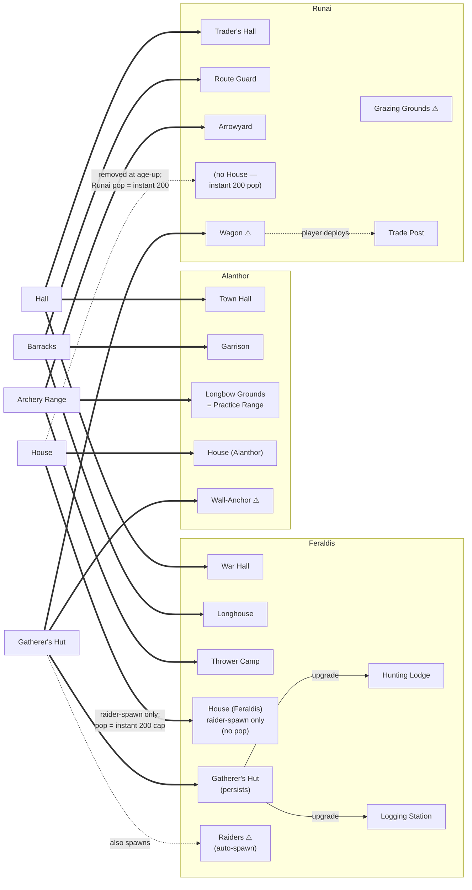

# The Waning Border — Tech Tree

> Age-of-Empires-style "tech tree page" view of every civ. Each chart shows
> every building as a header, with the units it trains and the techs it
> researches grouped underneath. Sects intentionally omitted (separate
> diagram once the 12-sect redesign in
> [task-sect-system-redesign-063](../../.deft/tasks/task-sect-system-redesign-063/task.md)
> stabilizes).
>
> **Legend:**
> - Rectangles (subgraph titles) = **buildings**
> - Rounded `([ ])` shapes = **units** (battalion or single — per [Overview.md § Unit granularity](Overview.md#unit-granularity--single-units-vs-battalions))
> - Hexagons `{{ }}` = **technologies**
> - Arrow `tech_A --> tech_B` between two hex nodes = `tech_B` **requires** `tech_A` (research chain)
> - Dotted arrow `unit_A -.-> unit_B` between two rounded nodes = `unit_B` is the **L2/L3 tier unlock** of `unit_A` at the same building (the player still trains them as separate battalions; the unlock is gated by building level, not a per-unit promotion)
> - **❓** = name in design draft, **code mapping not yet confirmed**
> - **⚠** = **new** — does not yet exist in code
>
> Tech-tier hex chains (Stone → Iron → Veilstone → Glow / Veilsteel) follow
> the **per-battalion upgrade pattern** ([Overview.md § Per-battalion upgrades](Overview.md#per-battalion-military-upgrades-cross-faction-rule))
> — researching the hex unlocks an upgrade button on each existing battalion;
> upgrades are paid for **per-battalion** when applied. Glow-tier techs
> additionally require Glow from border-node interactions ([Overview.md § Glow economy](Overview.md#the-glow-economy-cross-faction)).
>
> Open in VSCode (built-in Mermaid preview ⌃⇧V on the file), GitHub, or any
> Mermaid-aware viewer.

---

## 1 — Age-up transitions (buildings only)

---

## 2 — Age 0 tech tree (shared by all factions)

Every player starts here. Build any of the three Choice buildings to enable
age-up.

```mermaid
flowchart TB
    subgraph Hall0["Hall — lvl 0"]
        direction TB
        h_w(["Worker"])
        h_s(["Scout"])
        h_t1{{"Stone tools"}}
        h_t3{{"Research Era II"}}
    end

    subgraph Bar0["Barracks — lvl 0"]
        direction TB
        b_sp(["Spearman"])
        b_t1{{"Conscription"}}
        b_t2{{"Stone weapons"}}
    end

    subgraph AR0["Archery Range — lvl 0"]
        direction TB
        a_ar(["Archer"])
        a_t1{{"Choreographed volleys"}}
        a_t2{{"Stone-tipped arrows"}}
        a_t3{{"Fletching"}}
    end

    subgraph House0["House — lvl 0"]
        direction TB
        ho_note["(provides population)"]
    end

    subgraph GH0["Gatherer's Hut — lvl 0"]
        direction TB
        gh_note["(supply trickle)"]
    end

    subgraph Vault0["Vault of Almiérra — choice, lvl 1"]
        direction TB
        v_t1{{"Coffers"}}
        v_t2{{"Merchant Charters"}}
        v_t3{{"Sovereign Bonds"}}
        v_t4{{"Iron Subsidies"}}
        v_t5{{"Veilstone monetization"}}
        v_t6{{"Veilsteel Bonds"}}
        v_t1 --> v_t2 --> v_t3
        v_t4 --> v_t5 --> v_t6
    end

    subgraph Shrine0["Temple of Ridan — choice, lvl 1 (caps at L3)"]
        direction TB
        s_lith(["Litharch<br/>(0 damage by default)"])
        s_t1{{"Heightened masses"}}
        s_t2{{"Pious masses"}}
        s_t3{{"Fervored masses"}}
        s_t4{{"Warrior priests"}}
        s_t1 --> s_t2 --> s_t3
    end

    subgraph Keep0["Fiendstone Keep — choice, lvl 1<br/>(range 30, 4 max targets)"]
        direction TB
        k_sp(["Spearman"])
        k_ar(["Archer"])
        k_t1{{"Ballista emplacement"}}
        k_t2{{"Trebuchet emplacement"}}
        k_t3{{"Additional Towers"}}
        k_t4{{"Reinforced walls"}}
    end
```

---

## 3 — Alanthor (Age 1)

Defensive culture. The Wall family, long-range archery, and a four-tier
Tools / Weapons ladder define the Alanthor late game. *(Plus the three
Choice buildings from Age 0 — Vault / Shrine / Keep — persist with their
Alanthor culture modifiers: +30 % Vault yield, neutral Shrine, −50 %
Keep HP & arrows.)*

```mermaid
flowchart TB
    subgraph TH_A["Town Hall (cultured Hall)"]
        direction TB
        a_w(["Worker"])
        a_s(["Scout"])
        a_t1{{"Stone tools"}}
        a_t2{{"Iron tools"}}
        a_t3{{"Veilstone tools"}}
        a_t4{{"Veilsteel tools"}}
        a_t5{{"Wheel cart"}}
        a_t6{{"Cranes"}}
        a_t7{{"Mason Guild"}}
        a_t8{{"Stone Ledgers"}}
        a_t1 --> a_t2 --> a_t3 --> a_t4
    end

    subgraph Gar["Garrison (cultured Barracks)"]
        direction TB
        a_sp(["Spearman"])
        a_sw(["Swordsman ⚠"])
        a_rg(["Royal Guard ⚠"])
        a_sn(["Sentinel<br/>(parallel — damage sponge)"])
        a_g_t1{{"Conscription"}}
        a_g_t2{{"Academy"}}
        a_g_t3{{"Stone weapons"}}
        a_g_t4{{"Iron weapons"}}
        a_g_t5{{"Veilstone weapons"}}
        a_g_t6{{"Glow-infused weapons ⚠"}}
        a_g_t3 --> a_g_t4 --> a_g_t5 --> a_g_t6
        a_sp -.->|"L2 unlock"| a_sw -.->|"L3 unlock"| a_rg
    end

    subgraph RS_A["Royal Stable ⚠ (new — Cataphract host)"]
        direction TB
        a_cat(["Cataphract"])
        a_cav2(["L2 cavalry tier ⚠"])
        a_cav3(["L3 cavalry tier ⚠"])
        a_rs_t1{{"Barding (TBD name)"}}
        a_rs_t2{{"Iron barding"}}
        a_rs_t3{{"Veilstone barding"}}
        a_rs_t4{{"Glow-bonded barding ⚠"}}
        a_rs_t1 --> a_rs_t2 --> a_rs_t3 --> a_rs_t4
        a_cat -.->|"L2 unlock"| a_cav2 -.->|"L3 unlock"| a_cav3
    end

    subgraph PR_A["Practice Range / Longbow Grounds"]
        direction TB
        a_arc(["Archer"])
        a_xb(["Crossbowman"])
        a_l3r(["L3 ranged apex ⚠<br/>(Longbowman?)"])
        a_p_t1{{"Choreographed volleys"}}
        a_p_t2{{"Fletching"}}
        a_p_t3{{"Stone-tipped arrows"}}
        a_p_t4{{"Iron-tipped arrows ⚠"}}
        a_p_t5{{"Veilstone-tipped arrows ⚠"}}
        a_p_t6{{"Glow-tipped arrows ⚠"}}
        a_p_t3 --> a_p_t4 --> a_p_t5 --> a_p_t6
        a_arc -.->|"L2 unlock"| a_xb -.->|"L3 unlock"| a_l3r
    end

    subgraph H_A["House (Alanthor)"]
        direction TB
        a_h_note["(provides population)"]
    end

    subgraph WT_A["Watch Tower"]
        direction TB
        a_wt_note["(garrison + arrow-fire)"]
    end

    subgraph Wall_A["Walls (Alanthor)"]
        direction TB
        a_wall(["Wall Segment"])
        a_wall_t(["Wall Tower"])
        a_wall_g(["Wall Gate"])
    end

    subgraph Smelt_A["Smelter"]
        direction TB
        a_sm_note["(refines Iron)"]
    end

    subgraph Cruc_A["Crucible"]
        direction TB
        a_cr_note["(forges Veilsteel<br/>from Iron + Veilstone)"]
    end

    subgraph SY_A["Siege Yard (A)"]
        direction TB
        a_bal(["Ballista"])
    end

    subgraph ShrineA["Temple of Ridan (Alanthor pick)"]
        direction TB
        a_lith(["Litharch<br/>(0 damage by default)"])
        a_sch(["Scholar — at L3<br/>(game-ender tier)"])
    end
```

---

## 4 — Runai (Age 1)

Economy / movement culture. **No walls. No Houses** — full pop unlocked at
age-up. The trade-lane network *is* the economy + army + territory.
*(Plus Choice buildings: Vault −30 %, Shrine +30 %, Keep neutral.)*

```mermaid
flowchart TB
    subgraph TrH_R["Trader's Hall (cultured Hall)"]
        direction TB
        r_w(["Worker"])
        r_s(["Scout"])
        r_t1{{"Stone tools"}}
        r_t2{{"Iron tools ⚠"}}
        r_t3{{"Veilstone tools ⚠"}}
        r_t4{{"Veilsteel tools ⚠"}}
        r_t5{{"Wheel cart equiv ⚠"}}
        r_t6{{"Cranes equiv ⚠"}}
        r_tcn{{"Border-neutrality ⚠<br/>(-20% wave aggro)"}}
        r_t1 --> r_t2 --> r_t3 --> r_t4
    end

    subgraph TB_R["Thessara's Bazaar ⚠<br/>(repurposed — trade-lane upgrades only)"]
        direction TB
        tb_t1{{"LongHaulTariffs"}}
        tb_t2{{"EscortedCaravans"}}
        tb_note["(does NOT train units;<br/>PackBazaar retired)"]
    end

    subgraph RG_R["Route Guard (cultured Barracks)"]
        direction TB
        rg_sp(["Runai Spearman"])
        rg_sw(["L2 infantry ⚠"])
        rg_apex(["L3 infantry apex ⚠"])
        rg_t1{{"Conscription equiv ⚠"}}
        rg_t3{{"Stone weapons"}}
        rg_t4{{"Iron weapons ⚠"}}
        rg_t5{{"Veilstone weapons ⚠"}}
        rg_t6{{"Glow-infused weapons ⚠"}}
        rg_t3 --> rg_t4 --> rg_t5 --> rg_t6
        rg_sp -.->|"L2 unlock"| rg_sw -.->|"L3 unlock"| rg_apex
    end

    subgraph AY_R["Arrowyard (cultured Archery Range)"]
        direction TB
        ay_sk(["Skirmisher"])
        ay_r2(["L2 ranged ⚠"])
        ay_r3(["L3 ranged apex ⚠"])
        ay_t1{{"Choreographed volleys"}}
        ay_t2{{"Fletching"}}
        ay_t3{{"Stone-tipped arrows"}}
        ay_t4{{"Iron-tipped arrows ⚠"}}
        ay_t5{{"Veilstone-tipped arrows ⚠"}}
        ay_t6{{"Glow-tipped arrows ⚠"}}
        ay_t3 --> ay_t4 --> ay_t5 --> ay_t6
        ay_sk -.->|"L2 unlock"| ay_r2 -.->|"L3 unlock"| ay_r3
    end

    subgraph GG_R["Grazing Grounds ⚠<br/>(new — cavalry trainer)"]
        direction TB
        gg_rd(["Runai Raider<br/>(light cavalry)"])
        gg_ca(["Cavalry Archer ⚠"])
        gg_l3(["L3 cavalry apex ⚠"])
        gg_t1{{"Barding T1 ⚠"}}
        gg_t2{{"Barding T2 ⚠"}}
        gg_t3{{"Barding T3 ⚠"}}
        gg_t4{{"Barding T4 ⚠"}}
        gg_t1 --> gg_t2 --> gg_t3 --> gg_t4
        gg_rd -.->|"L2 unlock"| gg_ca -.->|"L3 unlock"| gg_l3
    end

    subgraph OP_R["Runai Outpost"]
        direction TB
        op_note["(trade-route anchor +<br/>vision pylon)"]
    end

    subgraph THub_R["Runai Trade Hub"]
        direction TB
        r_car(["Caravan (uncontrollable)<br/>cargo on death → Feraldis killer"])
        r_esc(["Escort (uncontrollable)<br/>w/ EscortedCaravans"])
        r_tw(["Trader-Warrior ⚠<br/>(uncontrollable patrol;<br/>global cap = +1 / soldier trained)"])
    end

    subgraph VF_R["Veilsteel Foundry (R)"]
        direction TB
        r_vf_note["(forges Veilsteel<br/>from Iron + Veilstone —<br/>same rate as Alanthor)"]
    end

    subgraph SW_R["Siege Workshop (R)"]
        direction TB
        r_sb(["SandBallista"])
    end

    subgraph ShrineR["Temple of Ridan (Runai pick)"]
        direction TB
        r_lith(["Litharch"])
        r_aco(["Acolyte — at L3<br/>(game-ender tier)"])
    end

    %% Age-up power-spike chain
    Wagon_R["Wagon ⚠<br/>(from age-up huts —<br/>4-min linear decay)"] -.->|"plant"| OP_R
    OP_R -.->|"enables"| THub_R

    %% No House, no Walls
    NoHouse_R["(no House — instant 200 pop at age-up)"]
    NoWalls_R["(no Walls — identity-defining)"]
```

---

## 5 — Feraldis (Age 1)

Military culture. Damage-as-income with the Border floor; persistent
gather buildings; **no Houses**. *(Plus Choice buildings: Vault neutral,
Shrine −30 %, Keep +50 % HP & arrows — Feraldis has the natural Keep
fortress identity.)*

```mermaid
flowchart TB
    subgraph WH_F["War Hall (cultured Hall)"]
        direction TB
        f_w(["Worker"])
        f_s(["Scout"])
        f_t1{{"Stone tools"}}
        f_t2{{"Iron tools"}}
        f_t3{{"Veilstone tools"}}
        f_t4{{"Veilsteel tools"}}
        f_t5{{"Wheel cart"}}
        f_t6{{"Cranes"}}
        f_pil{{"Pillage"}}
        f_vf{{"Veilsteel Frenzy ⚠<br/>(was IronFury)"}}
        f_t1 --> f_t2 --> f_t3 --> f_t4
    end

    subgraph LH_F["Longhouse (cultured Barracks)"]
        direction TB
        f_sp(["Spearman"])
        f_sw(["Swordsman ⚠"])
        f_rg(["Royal Guard ⚠<br/>(culture name TBD)"])
        f_bz(["Berserker<br/>(parallel — damage)"])
        f_wb(["Warboar Rider<br/>(cavalry — no Royal Stable)"])
        f_l_t1{{"Conscription"}}
        f_l_t3{{"Stone weapons"}}
        f_l_t4{{"Iron weapons"}}
        f_l_t5{{"Veilstone weapons"}}
        f_l_t6{{"Glow-infused weapons ⚠"}}
        f_l_t3 --> f_l_t4 --> f_l_t5 --> f_l_t6
        f_sp -.->|"L2 unlock"| f_sw -.->|"L3 unlock"| f_rg
        lh_note["+ batch training<br/>(5 / 10 with discounts)<br/>+ stacks with Keep<br/>+25% train aura"]
    end

    subgraph TC_F["Thrower Camp (cultured Archery Range)"]
        direction TB
        f_hu(["Hunter"])
        f_r2(["L2 ranged tier ⚠"])
        f_r3(["L3 ranged apex ⚠"])
        f_p_t1{{"Choreographed volleys"}}
        f_p_t2{{"Fletching"}}
        f_p_t3{{"Stone-tipped arrows"}}
        f_p_t4{{"Iron-tipped arrows ⚠"}}
        f_p_t5{{"Veilstone-tipped arrows ⚠"}}
        f_p_t6{{"Glow-tipped arrows ⚠"}}
        f_p_t3 --> f_p_t4 --> f_p_t5 --> f_p_t6
        f_hu -.->|"L2 unlock"| f_r2 -.->|"L3 unlock"| f_r3
    end

    subgraph H_F["House (Feraldis)"]
        direction TB
        f_raid_h(["Raider ⚠<br/>(auto-spawn on<br/>build / upgrade —<br/>uncontrolled)"])
    end

    subgraph FGH_F["Gatherer's Hut (persists)"]
        direction TB
        f_raid_g(["Raider ⚠<br/>(auto-spawn at age-up —<br/>auto-patrols outward)"])
    end

    subgraph HL_F["Hunting Lodge<br/>(+30% near mountains)"]
        direction TB
        hl_note["(upgraded hut —<br/>mountain game)"]
    end

    subgraph LS_F["Logging Station<br/>(+30% near trees)"]
        direction TB
        ls_note["(upgraded hut —<br/>forest / wood)"]
    end

    subgraph FF_F["Fiend Foundry"]
        direction TB
        ff_note["(Veilsteel forging —<br/>fewer inputs than<br/>Alanthor/Runai)"]
    end

    subgraph TT_F["Totem Tower"]
        direction TB
        tt_note["(garrison + arrow-fire<br/>+ bloody-ground aura)"]
    end

    subgraph SY_F["Siege Yard (F)"]
        direction TB
        f_sr(["Siege Ram"])
    end

    subgraph ShrineF["Temple of Ridan (Feraldis pick)"]
        direction TB
        f_lith(["Litharch<br/>(0 damage by default)"])
        f_ico(["Iconoclast — at L3<br/>(game-ender tier)"])
    end

    %% Hut upgrade chain — player picks one
    FGH_F -.->|"player picks one<br/>(tech-locked)"| HL_F
    FGH_F -.->|"player picks one<br/>(tech-locked)"| LS_F
```

---

## Reading order for a new player

1. Skim **Age-up transitions** to see what each Age 0 building becomes.
2. Read **Age 0** to see the shared starting kit.
3. Pick a faction page (Alanthor / Runai / Feraldis) to see what that
   culture's late game looks like.
4. The three Choice buildings (Vault / Shrine / Keep) appear on the Age 0
   page once and persist into every faction page — modifier deltas noted in
   the faction blurbs above. Their tech list does not change at age-up.
