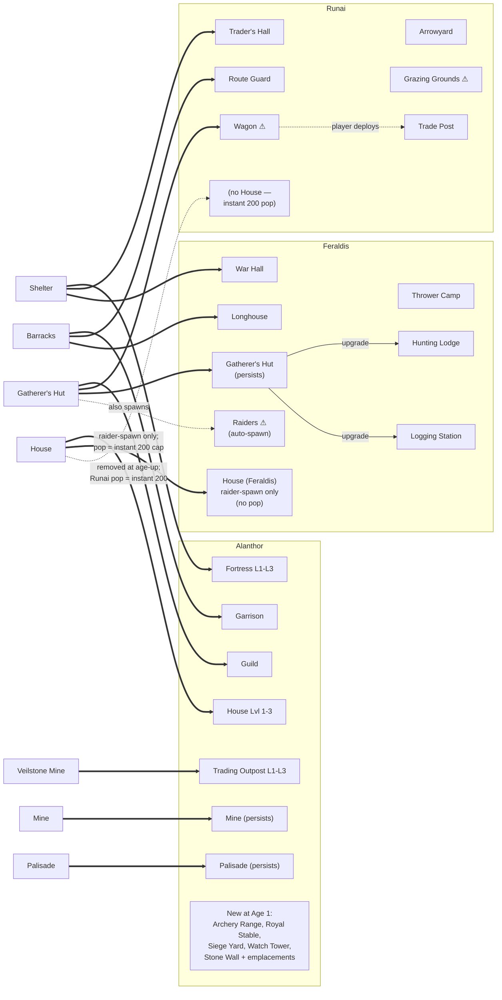

# The Waning Border — Tech Tree

> Age-of-Empires-style "tech tree page" view of every civ. Each chart shows
> every building as a header, with the units it trains and the techs it
> researches grouped underneath. Sects intentionally omitted (separate
> diagram once the 12-sect redesign in
> [task-sect-system-redesign-063](../../.deft/tasks/task-sect-system-redesign-063/task.md)
> stabilizes).
>
> **The Age 0 and Alanthor charts mirror the ScriptableObjects** under
> `Assets/GameData/TechTree/` (the single source of game data): each
> building's `trains[]`, each tech's `researchAt` / `minBuildingLevel` /
> prerequisites / culture gate, and each unit's `minBuildingLevel`. On a
> conflict the SO wins. **These charts carry no stat numbers** — for costs,
> HP, damage, times and population open the calculator generated from the
> SOs, [tools/calculator/TechTree.html](../../tools/calculator/TechTree.html)
> (built by `tools/gen_calculator.py`). The same structure as an interactive
> page: [TechTreeViz.html](TechTreeViz.html).
>
> **Legend:**
> - Rectangles (subgraph titles) = **buildings**
> - Rounded `([ ])` shapes = **units** (battalion or single — per [Overview.md § Unit granularity](Overview.md#unit-granularity--single-units-vs-battalions))
> - Hexagons `{{ }}` = **technologies**
> - Plain boxes inside a wall subgraph = **wall pieces** (segments, conversions)
> - Arrow `tech_A --> tech_B` between two hex nodes = `tech_B` **requires** `tech_A` (the tech SO's prerequisite)
> - **L1 / L2 / L3** on a unit or tech = the **building level** it needs (the SO's `minBuildingLevel`, the only level gate); no label = no level gate
> - **(all)** on an Age 1 tech = an Age 0 tech every culture keeps; the other techs on the Alanthor page are **Alanthor-gated** on the tech SO, or sit on an Alanthor-only building (the Archery Range's Fletching / Choreographed Volleys / Stone-Tipped Arrows)
> - **❓** = name in design draft, **code mapping not yet confirmed** (Runai / Feraldis pages)
> - **⚠** = **new** — does not yet exist in code (Runai / Feraldis pages)
>
> Techs are **faction-wide**: researching one applies to every unit it
> covers, existing and future. (The old per-battalion upgrade pattern is
> dropped.)
>
> Open in VSCode (built-in Mermaid preview ⌃⇧V on the file), GitHub, or any
> Mermaid-aware viewer.

---

## 1 — Age-up transitions (buildings only)

The Alanthor column follows the SOs. The Runai and Feraldis columns are
not yet reconciled with the SO roster: their ranged buildings (Arrowyard,
Thrower Camp) have no Age 0 source, because Age 0 has no Archery Range.

```mermaid
flowchart LR
    Cap0["Shelter"]
    Bar0["Barracks"]
    H0["House"]
    GH0["Gatherer's Hut"]
    VM0["Veilstone Mine"]
    Mi0["Mine"]
    Pal0["Palisade"]

    subgraph Alanthor
        TH_A["Fortress L1-L3"]
        Gar["Garrison"]
        H_A["House Lvl 1-3"]
        Guild_A["Guild"]
        TO_A["Trading Outpost L1-L3"]
        Mi_A["Mine (persists)"]
        Pal_A["Palisade (persists)"]
        New_A["New at Age 1:<br/>Archery Range, Royal Stable,<br/>Siege Yard, Watch Tower,<br/>Stone Wall + emplacements"]
    end

    subgraph Runai
        TrH["Trader's Hall"]
        RG_R["Route Guard"]
        AY_R["Arrowyard"]
        GG_R["Grazing Grounds ⚠"]
        NoHouse_R["(no House —<br/>instant 200 pop)"]
        Wagon["Wagon ⚠"]
        TP["Trade Post"]
    end

    subgraph Feraldis
        WH_F["War Hall"]
        LH_F["Longhouse"]
        TC_F["Thrower Camp"]
        H_F["House (Feraldis)<br/>raider-spawn only<br/>(no pop)"]
        FGH_F["Gatherer's Hut<br/>(persists)"]
        HL_F["Hunting Lodge"]
        LS_F["Logging Station"]
        FR_F["Raiders ⚠<br/>(auto-spawn)"]
    end

    Cap0 ==> TH_A & TrH & WH_F
    Bar0 ==> Gar & RG_R & LH_F
    H0 ==> H_A
    H0 ==>|"raider-spawn only;<br/>pop = instant 200 cap"| H_F
    H0 -.->|"removed at age-up;<br/>Runai pop = instant 200"| NoHouse_R
    GH0 ==> Guild_A
    VM0 ==> TO_A
    Mi0 ==> Mi_A
    Pal0 ==> Pal_A
    GH0 ==> Wagon
    GH0 ==> FGH_F
    GH0 -.->|"also spawns"| FR_F
    Wagon -.->|"player deploys"| TP
    FGH_F -->|"upgrade"| HL_F
    FGH_F -->|"upgrade"| LS_F
```

---

## 2 — Age 0 tech tree (shared by all factions)

Every player starts here. Build any of the three Choice buildings to enable
age-up. The capital is the **Shelter** (id `Fortress`); at age-up it
becomes the **Fortress** automatically, for every culture (same building).
There is no Hall, King's Court or Town Hall, and no Shrine of Ridan. Age 0
is the melee age: there is **no Archery Range** before age-up. The Mine and
the Veilstone Mine are Age 0 buildings for everyone.

```mermaid
flowchart TB
    subgraph Cap0["Shelter (capital, id Fortress)"]
        direction TB
        h_w(["Worker"])
        h_s(["Scout"])
        h_t1{{"Stone Tools"}}
        h_t2{{"Armed Scouts"}}
    end

    subgraph Bar0["Barracks"]
        direction TB
        b_sp(["Spearman"])
        b_t1{{"Conscription"}}
        b_t2{{"Stone Weapons"}}
    end

    subgraph House0["House (id Hut)"]
        direction TB
        ho_note["(provides population)"]
    end

    subgraph GH0["Gatherer's Hut"]
        direction TB
        gh_note["(territory income;<br/>no research in Age 0)"]
    end

    subgraph Mine0["Mine (iron)"]
        direction TB
        mi_t1{{"Deep Shafts"}}
        mi_t2{{"Rich Seams"}}
        mi_t1 --> mi_t2
    end

    subgraph VMine0["Veilstone Mine"]
        direction TB
        vm_note["(Alanthor: becomes a<br/>Trading Outpost at age-up,<br/>moved beside its outcrop)"]
    end

    subgraph Pal0["Palisade (timber wall)"]
        direction TB
        pal_seg["Palisade Section"]
        pal_gate["Wall Gate (conversion)"]
    end

    subgraph Vault0["Vault of Almiérra — choice"]
        direction TB
        v_t1{{"Coffers"}}
        v_t2{{"Merchant Charters"}}
        v_t3{{"Sovereign Bonds"}}
        v_t4{{"Iron Subsidies"}}
        v_t5{{"Veilstone Monetization · L2"}}
        v_t6{{"Veilsteel Bonds · L3"}}
    end

    subgraph Temple0["Temple of Ridan — choice (one per faction, no levels)"]
        direction TB
        s_lith(["Litharch<br/>(healer)"])
        s_t1{{"Heightened Masses"}}
        s_t2{{"Pious Masses"}}
        s_t3{{"Fervored Masses"}}
        s_t4{{"Warrior Priests"}}
        s_t1 --> s_t2 --> s_t3
    end

    subgraph Keep0["Fiendstone Keep — choice<br/>(awaiting the Feraldis pass)"]
        direction TB
        k_sp(["Spearman"])
        k_t1{{"Ballista Emplacement"}}
        k_t2{{"Trebuchet Emplacement"}}
        k_t3{{"Additional Towers"}}
        k_t4{{"Reinforced Walls"}}
        k_t1 --> k_t2
    end
```

---

## 3 — Alanthor (Age 1)

Defensive culture. The stone wall family, the Archery Range ladder and the
Iron → Veilstone → Shard equipment ladders define the Alanthor late game.
*(Plus the three Choice buildings from Age 0 — Vault / Temple / Keep —
persist, with the Alanthor culture modifiers on their SOs; the Mine and
the Palisade persist unchanged.)* Every culture building's L1 is free at
age-up. There is no Smelter, Crucible or Academy: each armour ladder
researches at the building that trains the units it protects. Alanthor
never mine veilstone — their Veilstone Mines become **Trading Outposts**,
which stand beside an outcrop, up to four per outcrop (one per side), each
further post there costing more.

```mermaid
flowchart TB
    subgraph TH_A["Fortress L1-L3 (the Shelter after age-up)"]
        direction TB
        a_w(["Worker"])
        a_s(["Scout"])
        a_led(["Ledger · L2"])
        a_lex(["King Lexor · L3<br/>(hero)"])
        a_t1{{"Stone Tools (all)"}}
        a_t5{{"Armed Scouts (all)"}}
        a_t8{{"Scouting Celestarii"}}
        a_t2{{"Iron Tools · L2"}}
        a_t7{{"Mason Guild · L2"}}
        a_t3{{"Veilstone Tools · L3"}}
        a_t4{{"Veilsteel Tools · L3"}}
    end

    subgraph Gar["Garrison L1-L3 (cultured Barracks)"]
        direction TB
        a_sp(["Spearman"])
        a_sw(["Swordsman · L1"])
        a_nb(["Nobleman · L2"])
        a_sn(["Sentinel · L3"])
        a_g_t1{{"Conscription (all)"}}
        a_g_t3{{"Stone Weapons (all)"}}
        a_g_t4{{"Iron Weapons · L1"}}
        a_g_t5{{"Veilstone Weapons · L2"}}
        a_g_t6{{"Shard-infused Weapons · L3"}}
        a_g_p1{{"Iron Plate · L1"}}
        a_g_p2{{"Veilstone Plate · L2"}}
        a_g_p3{{"Shard Plate · L3"}}
        a_g_v1{{"Seasoned Infantry · L1"}}
        a_g_v2{{"Veteran Infantry · L2"}}
        a_g_v3{{"Elite Infantry · L3"}}
        a_g_c1{{"Charge · L2"}}
        a_g_c2{{"Shield Wall · L3"}}
        a_g_t3 --> a_g_t4 --> a_g_t5 --> a_g_t6
        a_g_p1 --> a_g_p2 --> a_g_p3
        a_g_v1 --> a_g_v2 --> a_g_v3
        a_g_c1 --> a_g_c2
    end

    subgraph AR_A["Archery Range L1-L3 (new at Age 1)"]
        direction TB
        a_arc(["Archer"])
        a_xb(["Crossbowman · L2"])
        a_lb(["Longbowman · L3"])
        a_p_t1{{"Choreographed Volleys"}}
        a_p_t2{{"Fletching"}}
        a_p_t3{{"Stone-Tipped Arrows"}}
        a_p_t4{{"Iron-Tipped Arrows · L1"}}
        a_p_t5{{"Veilstone-Tipped Arrows · L2"}}
        a_p_t6{{"Shard-Tipped Arrows · L3"}}
        a_p_b1{{"Iron Brigandine · L1"}}
        a_p_b2{{"Veilstone Brigandine · L2"}}
        a_p_b3{{"Shard Brigandine · L3"}}
        a_p_v1{{"Seasoned Archers · L1"}}
        a_p_v2{{"Veteran Archers · L2"}}
        a_p_v3{{"Elite Archers · L3"}}
        a_p_av{{"Arrow Volley"}}
        a_p_as{{"Arrow Shower · L2"}}
        a_p_ds{{"Deploy Stakes · L3"}}
        a_p_t3 --> a_p_t4 --> a_p_t5 --> a_p_t6
        a_p_b1 --> a_p_b2 --> a_p_b3
        a_p_v1 --> a_p_v2 --> a_p_v3
        a_p_av --> a_p_as
    end

    subgraph RS_A["Royal Stable L1-L3"]
        direction TB
        a_out(["Outrider · L1"])
        a_cat(["Cataphract · L3"])
        a_rs_l0{{"Stone-Barded Lances"}}
        a_rs_l1{{"Iron-Barded Lances · L1"}}
        a_rs_l2{{"Veilstone Lances · L2"}}
        a_rs_l3{{"Shard-infused Lances · L3"}}
        a_rs_t2{{"Iron Barding · L1"}}
        a_rs_t3{{"Veilstone Barding · L2"}}
        a_rs_t4{{"Shard Barding · L3"}}
        a_rs_v1{{"Seasoned Cavalry · L1"}}
        a_rs_v2{{"Veteran Cavalry · L2"}}
        a_rs_v3{{"Elite Cavalry · L3"}}
        a_rs_ch{{"Charge · L1"}}
        a_rs_wh{{"War Horn · L2"}}
        a_rs_fg{{"Full Gallop · L3"}}
        a_rs_l0 --> a_rs_l1 --> a_rs_l2 --> a_rs_l3
        a_rs_t2 --> a_rs_t3 --> a_rs_t4
        a_rs_v1 --> a_rs_v2 --> a_rs_v3
        a_rs_wh --> a_rs_fg
    end

    subgraph SY_A["Siege Yard L1-L3 (all four engines coexist)"]
        direction TB
        a_bal(["Ballista · L1"])
        a_cpt(["Catapult · L1"])
        a_ram(["Battering Ram · L2"])
        a_tre(["Trebuchet · L3"])
        a_sy_s0{{"Stone Shot"}}
        a_sy_s1{{"Iron Shot · L1"}}
        a_sy_s2{{"Veilstone Shot · L2"}}
        a_sy_s3{{"Shard-infused Shot · L3"}}
        a_sy_p1{{"Iron Plating · L1"}}
        a_sy_p2{{"Veilstone Plating · L2"}}
        a_sy_p3{{"Shard Plating · L3"}}
        a_sy_v1{{"Seasoned Crews · L1"}}
        a_sy_v2{{"Veteran Crews · L2"}}
        a_sy_v3{{"Elite Crews · L3"}}
        a_sy_rb{{"Reinforced Bolts · L1"}}
        a_sy_ir{{"Iron-Shod Ram · L2"}}
        a_sy_rs{{"Ranging Shot · L2"}}
        a_sy_sc{{"Siege Screens · L3"}}
        a_sy_ct{{"Counterweight Tuning · L3"}}
        a_sy_s0 --> a_sy_s1 --> a_sy_s2 --> a_sy_s3
        a_sy_p1 --> a_sy_p2 --> a_sy_p3
        a_sy_v1 --> a_sy_v2 --> a_sy_v3
        a_sy_rs --> a_sy_sc
    end

    subgraph Guild_A["Guild L1-L3 (cultured Gatherer's Hut)"]
        direction TB
        a_gu_i1{{"Iron Surveying I"}}
        a_gu_i2{{"Iron Survey II · L2"}}
        a_gu_i3{{"Iron Survey III · L3"}}
        a_gu_v1{{"Veilstone Survey I · L2"}}
        a_gu_v2{{"Veilstone Survey II · L3"}}
        a_gu_vs{{"Veilsteel Survey · L3"}}
        a_gu_r1{{"Iron Reinforcements"}}
        a_gu_r2{{"Veilstone Walls · L2"}}
        a_gu_r3{{"Veilsteel Pylons · L3"}}
        a_gu_i1 --> a_gu_i2 --> a_gu_i3
        a_gu_i1 --> a_gu_v1 --> a_gu_v2 --> a_gu_vs
        a_gu_r1 --> a_gu_r2 --> a_gu_r3
    end

    subgraph TO_A["Trading Outpost L1-L3 (the Veilstone Mine after age-up; up to 4 per outcrop, one per side)"]
        direction TB
        a_to_t1{{"Trade Agreements I"}}
        a_to_t2{{"Trade Agreements II"}}
        a_to_t3{{"Trade Agreements III"}}
        a_to_sc{{"Swift Caravans"}}
        a_to_vf{{"Veilsteel Forging"}}
        a_to_ve{{"Veilsteel Export"}}
        a_to_t1 --> a_to_sc
    end

    subgraph H_A["House L1-L3 (cultured Hut)"]
        direction TB
        a_h_note["(provides population)"]
    end

    subgraph WT_A["Watch Tower L1-L3"]
        direction TB
        a_wt_note["(directly buildable;<br/>garrison adds arrows)"]
    end

    subgraph Wall_A["Stone Wall L1-L3 (Alanthor only)"]
        direction TB
        a_wall["Wall Segment"]
        a_wall_t["Wall Tower (conversion)"]
        a_wall_g["Wall Gate (conversion)"]
        a_wl_t1{{"Battlements"}}
        a_wl_t2{{"Shielded Ramparts"}}
        a_wl_t1 --> a_wl_t2
    end

    subgraph BE_A["Ballista Emplacement<br/>(worker-built; Stone Wall L2+)"]
        direction TB
        a_ebal(["Emplaced Ballista · L1"])
    end

    subgraph TE_A["Trebuchet Emplacement<br/>(worker-built; Stone Wall L3)"]
        direction TB
        a_etre(["Emplaced Trebuchet · L1"])
    end

    subgraph TempleA["Temple of Ridan (persists, no levels)"]
        direction TB
        a_lith(["Litharch<br/>(healer)"])
    end
```

---

## 4 — Runai (Age 1)

Economy / movement culture. **No walls. No Houses** — full pop unlocked at
age-up. The trade-lane network *is* the economy + army + territory.
*(Plus Choice buildings: Vault −30 %, Temple +30 %, Keep neutral.)*

```mermaid
flowchart TB
    subgraph TrH_R["Trader's Hall (cultured Shelter)"]
        direction TB
        r_w(["Worker"])
        r_s(["Scout"])
        r_t1{{"Stone tools"}}
        r_t2{{"Iron tools ⚠"}}
        r_t3{{"Veilstone tools ⚠"}}
        r_t4{{"Veilsteel tools ⚠"}}
        r_t5{{"Wheel cart equiv ⚠"}}
        r_t6{{"Cranes equiv ⚠"}}
        r_tcn{{"Border-neutrality ⚠<br/>(-20% wave aggro)"}}
        r_t1 --> r_t2 --> r_t3 --> r_t4
    end

    subgraph TB_R["Thessara's Bazaar ⚠<br/>(repurposed — trade-lane upgrades only)"]
        direction TB
        tb_t1{{"LongHaulTariffs"}}
        tb_t2{{"EscortedCaravans"}}
        tb_note["(does NOT train units;<br/>PackBazaar retired)"]
    end

    subgraph RG_R["Route Guard (cultured Barracks)"]
        direction TB
        rg_sp(["Runai Spearman"])
        rg_sw(["L2 infantry ⚠"])
        rg_apex(["L3 infantry apex ⚠"])
        rg_t1{{"Conscription equiv ⚠"}}
        rg_t3{{"Stone weapons"}}
        rg_t4{{"Iron weapons ⚠"}}
        rg_t5{{"Veilstone weapons ⚠"}}
        rg_t6{{"Glow-infused weapons ⚠"}}
        rg_t3 --> rg_t4 --> rg_t5 --> rg_t6
        rg_sp -.->|"L2 unlock"| rg_sw -.->|"L3 unlock"| rg_apex
    end

    subgraph AY_R["Arrowyard (cultured Archery Range)"]
        direction TB
        ay_sk(["Skirmisher"])
        ay_r2(["L2 ranged ⚠"])
        ay_r3(["L3 ranged apex ⚠"])
        ay_t1{{"Choreographed volleys"}}
        ay_t2{{"Fletching"}}
        ay_t3{{"Stone-tipped arrows"}}
        ay_t4{{"Iron-tipped arrows ⚠"}}
        ay_t5{{"Veilstone-tipped arrows ⚠"}}
        ay_t6{{"Glow-tipped arrows ⚠"}}
        ay_t3 --> ay_t4 --> ay_t5 --> ay_t6
        ay_sk -.->|"L2 unlock"| ay_r2 -.->|"L3 unlock"| ay_r3
    end

    subgraph GG_R["Grazing Grounds ⚠<br/>(new — cavalry trainer)"]
        direction TB
        gg_rd(["Runai Raider<br/>(light cavalry)"])
        gg_ca(["Cavalry Archer ⚠"])
        gg_l3(["L3 cavalry apex ⚠"])
        gg_t1{{"Barding T1 ⚠"}}
        gg_t2{{"Barding T2 ⚠"}}
        gg_t3{{"Barding T3 ⚠"}}
        gg_t4{{"Barding T4 ⚠"}}
        gg_t1 --> gg_t2 --> gg_t3 --> gg_t4
        gg_rd -.->|"L2 unlock"| gg_ca -.->|"L3 unlock"| gg_l3
    end

    subgraph OP_R["Runai Outpost"]
        direction TB
        op_note["(trade-route anchor +<br/>vision pylon)"]
    end

    subgraph THub_R["Runai Trade Hub"]
        direction TB
        r_car(["Caravan (uncontrollable)<br/>cargo on death → Feraldis killer"])
        r_esc(["Escort (uncontrollable)<br/>w/ EscortedCaravans"])
        r_tw(["Trader-Warrior ⚠<br/>(uncontrollable patrol;<br/>global cap = +1 / soldier trained)"])
    end

    subgraph VF_R["Veilsteel Foundry (R)"]
        direction TB
        r_vf_note["(forges Veilsteel<br/>from Iron + Veilstone —<br/>same rate as Alanthor)"]
    end

    subgraph SW_R["Siege Workshop (R)"]
        direction TB
        r_sb(["SandBallista"])
    end

    subgraph TempleR["Temple of Ridan (Runai pick)"]
        direction TB
        r_lith(["Litharch"])
        r_aco(["Acolyte — at L3<br/>(game-ender tier)"])
    end

    %% Age-up power-spike chain
    Wagon_R["Wagon ⚠<br/>(from age-up huts —<br/>4-min linear decay)"] -.->|"plant"| OP_R
    OP_R -.->|"enables"| THub_R

    %% No House, no Walls
    NoHouse_R["(no House — instant 200 pop at age-up)"]
    NoWalls_R["(no Walls — identity-defining)"]
```

---

## 5 — Feraldis (Age 1)

Military culture. Damage-as-income with the Border floor; persistent
gather buildings; **no Houses**. *(Plus Choice buildings: Vault neutral,
Temple −30 %, Keep +50 % HP & arrows — Feraldis has the natural Keep
fortress identity.)*

```mermaid
flowchart TB
    subgraph WH_F["War Hall (cultured Shelter)"]
        direction TB
        f_w(["Worker"])
        f_s(["Scout"])
        f_t1{{"Stone tools"}}
        f_t2{{"Iron tools"}}
        f_t3{{"Veilstone tools"}}
        f_t4{{"Veilsteel tools"}}
        f_t5{{"Wheel cart"}}
        f_t6{{"Cranes"}}
        f_pil{{"Pillage"}}
        f_vf{{"Veilsteel Frenzy ⚠<br/>(was IronFury)"}}
        f_t1 --> f_t2 --> f_t3 --> f_t4
    end

    subgraph LH_F["Longhouse (cultured Barracks)"]
        direction TB
        f_sp(["Spearman"])
        f_sw(["Swordsman ⚠"])
        f_rg(["Royal Guard ⚠<br/>(culture name TBD)"])
        f_bz(["Berserker<br/>(parallel — damage)"])
        f_wb(["Warboar Rider<br/>(cavalry — no Royal Stable)"])
        f_l_t1{{"Conscription"}}
        f_l_t3{{"Stone weapons"}}
        f_l_t4{{"Iron weapons"}}
        f_l_t5{{"Veilstone weapons"}}
        f_l_t6{{"Glow-infused weapons ⚠"}}
        f_l_t3 --> f_l_t4 --> f_l_t5 --> f_l_t6
        f_sp -.->|"L2 unlock"| f_sw -.->|"L3 unlock"| f_rg
        lh_note["+ batch training<br/>(5 / 10 with discounts)<br/>+ stacks with Keep<br/>+25% train aura"]
    end

    subgraph TC_F["Thrower Camp (cultured Archery Range)"]
        direction TB
        f_hu(["Hunter"])
        f_r2(["L2 ranged tier ⚠"])
        f_r3(["L3 ranged apex ⚠"])
        f_p_t1{{"Choreographed volleys"}}
        f_p_t2{{"Fletching"}}
        f_p_t3{{"Stone-tipped arrows"}}
        f_p_t4{{"Iron-tipped arrows ⚠"}}
        f_p_t5{{"Veilstone-tipped arrows ⚠"}}
        f_p_t6{{"Glow-tipped arrows ⚠"}}
        f_p_t3 --> f_p_t4 --> f_p_t5 --> f_p_t6
        f_hu -.->|"L2 unlock"| f_r2 -.->|"L3 unlock"| f_r3
    end

    subgraph H_F["House (Feraldis)"]
        direction TB
        f_raid_h(["Raider ⚠<br/>(auto-spawn on<br/>build / upgrade —<br/>uncontrolled)"])
    end

    subgraph FGH_F["Gatherer's Hut (persists)"]
        direction TB
        f_raid_g(["Raider ⚠<br/>(auto-spawn at age-up —<br/>auto-patrols outward)"])
    end

    subgraph HL_F["Hunting Lodge<br/>(+30% near mountains)"]
        direction TB
        hl_note["(upgraded hut —<br/>mountain game)"]
    end

    subgraph LS_F["Logging Station<br/>(+30% near trees)"]
        direction TB
        ls_note["(upgraded hut —<br/>forest / wood)"]
    end

    subgraph FF_F["Fiend Foundry"]
        direction TB
        ff_note["(Veilsteel forging —<br/>fewer inputs than<br/>Alanthor/Runai)"]
    end

    subgraph TT_F["Totem Tower"]
        direction TB
        tt_note["(garrison + arrow-fire<br/>+ bloody-ground aura)"]
    end

    subgraph SY_F["Siege Yard (F)"]
        direction TB
        f_sr(["Siege Ram"])
    end

    subgraph TempleF["Temple of Ridan (Feraldis pick)"]
        direction TB
        f_lith(["Litharch<br/>(0 damage by default)"])
        f_ico(["Iconoclast — at L3<br/>(game-ender tier)"])
    end

    %% Hut upgrade chain — player picks one
    FGH_F -.->|"player picks one<br/>(tech-locked)"| HL_F
    FGH_F -.->|"player picks one<br/>(tech-locked)"| LS_F
```

---

## Reading order for a new player

1. Skim **Age-up transitions** to see what each Age 0 building becomes.
2. Read **Age 0** to see the shared starting kit.
3. Pick a faction page (Alanthor / Runai / Feraldis) to see what that
   culture's late game looks like.
4. The three Choice buildings (Vault / Temple / Keep) appear on the Age 0
   page once and persist into every faction page — modifier deltas noted in
   the faction blurbs above. Their tech list does not change at age-up.
